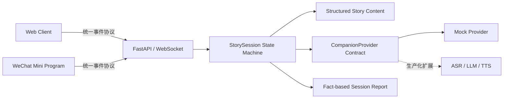

# StoryPal AI Reading Companion

> 一个支持“随时打断—语境回答—原句续播—互动报告”的儿童 AI 互动阅读产品原型，同时提供 Web 与微信小程序界面。

[产品逻辑](docs/product-logic.md) · [产品设计](docs/product-design.md) · [系统架构](docs/architecture.md) · [项目复盘](docs/case-study.md) · [消息协议](docs/protocol.md) · [安全边界](SECURITY.md)

## 60 秒看懂项目

StoryPal 解决有声故事的一个具体问题：播放通常是单向的，孩子在听故事时产生的问题和想法无法进入内容流程。核心设计目标是在保留故事连续性的同时，让孩子能够自然进入对话，并在对话后无认知断点地回到故事。

这个公开版把核心闭环做成可运行的状态机：

1. 播放到任意句时，孩子可以主动打断；
2. 系统保存 `node_id + sentence_index`，进入倾听态；
3. AI provider 基于当前故事语境回答；
4. 回答完成后回到被打断的原句继续；
5. 主动打断和引导式回答进入事实型互动报告。

公开仓库默认运行 Mock provider，不需要模型密钥。浏览器用 `SpeechSynthesis` 演示朗读，文字输入模拟 ASR，便于任何人复现产品流程。它验证的是 AI 应用的产品编排、跨端协议和异常状态控制，不把模型效果混同于产品闭环。

## 产品决策摘要

| 产品问题 | 设计决策 | 目的 |
| --- | --- | --- |
| 孩子在播放中产生问题 | 故事句播放时开放显著的打断入口 | 降低表达时机成本 |
| AI 回答会打断叙事记忆 | 保存 `node_id + sentence_index`，回答后重播原句 | 恢复语境，避免错位续播 |
| 所有节点都允许打断会产生状态冲突 | 仅 `playing + story node` 开放打断 | 保持状态可预期 |
| 自由提问不足以推动理解 | 在故事结构中插入 `interaction node` | 同时支持主动探索与引导表达 |
| 互动报告容易过度推断 | 只记录行为事实和对话时间线 | 避免把一次互动解释为能力诊断 |
| 不同端各自管理游标容易漂移 | Backend 作为唯一状态来源 | 保证 Web 与小程序行为一致 |

完整说明见 [产品逻辑](docs/product-logic.md) 和 [产品设计](docs/product-design.md)。

## 产品界面与信息架构

| Web 体验 | 微信小程序 |
| --- | --- |
| 故事馆、互动播放器、阅读报告 | 故事馆、播放器、报告、隐私说明 |
| 浏览器语音合成、文字模拟 ASR | 定时模拟播放完成、文字模拟 ASR |
| 适合快速体验完整闭环 | 保留移动端原生触达形态和核心流程 |

所有公开示例内容均为本仓库原创，无第三方故事、封面、录音或模型权重。

```text
故事馆 → 选择故事 → 互动播放器 ─┬→ 主动打断 → 输入问题 → AI 回答 → 原句续播
                              ├→ 引导节点 → 表达想法 → AI 回答 → 下一节点
                              └→ 故事结束 → 互动报告
```

## 快速开始

需要 Python 3.10+。

```bash
python3 -m venv .venv
source .venv/bin/activate
pip install -r requirements.txt
python -m backend.app
```

打开 [http://127.0.0.1:8000](http://127.0.0.1:8000)，选择《迷路的星光》。

运行测试：

```bash
python -m unittest discover -s tests -v
```

### 微信小程序

1. 复制 `miniprogram/project.config.example.json` 为 `miniprogram/project.config.json`；
2. 填写自己的 AppID，用微信开发者工具导入 `miniprogram/`；
3. 本地调试时关闭“校验合法域名”，并保持 backend 运行；
4. 真机调试需把 `miniprogram/utils/config.js` 指向已备案的 HTTPS/WSS 域名。

真实 AppID 和 private config 已被 `.gitignore` 排除。

## 核心架构



- **Backend 持有状态**：两个客户端只上报意图与播放完成事件，故事游标由 `StorySession` 统一推进。
- **内容结构化**：`story node` 负责叙事，`interaction node` 负责预设引导，内容和流程不写死在 UI 中。
- **AI 能力可替换**：工作流只依赖 `CompanionProvider.answer()`，公开版以确定性 Mock 保证可复现。
- **协议驱动跨端**：Web 与微信小程序消费同一事件，视觉实现不同，核心产品行为一致。
- **显式状态转换**：乱序消息进入 `error` 分支，降低并发播放、重复回答和错位续播风险。
- **本地安全默认值**：默认只监听 `127.0.0.1`；公开演示不上传录音，也不持久化儿童数据。

详见 [系统架构](docs/architecture.md) 与 [消息协议](docs/protocol.md)。

## 我负责的部分

- **产品定义**：从儿童听故事场景定义“打断—回答—续播”的核心体验、边界与成功条件；
- **产品逻辑**：设计自由打断与预设引导两类互动、故事恢复规则、异常顺序和报告口径；
- **系统设计**：设计 node/sentence 内容模型、统一 WebSocket 协议、状态机和 provider contract；
- **交互设计**：实现 Web 与微信小程序的信息架构、关键状态反馈、移动端播放器与报告页面；
- **AI Workflow 交付**：完成端到端可运行原型、测试和公开仓库工程化；
- **公开合规**：移除密钥、真实 AppID、第三方素材和供应商实现，改为原创内容与 Mock-first 演示。

项目过程与取舍见 [项目复盘](docs/case-study.md)。

## 当前边界

- 公开版验证的是 Workflow 编排与交互体验，不代表 ASR、LLM、TTS 的线上效果；
- 浏览器语音合成的音色由操作系统决定；微信小程序演示用定时器模拟播放完成；
- 报告只呈现互动事实，不做儿童心理、智力或教育诊断；
- 内存会话不适合生产部署，服务重启后报告会被清空；
- 生产化仍需账户体系、监护人同意、数据删除、内容审核、限流与可观测性。

## 仓库结构

```text
backend/          FastAPI、状态机、provider contract
web-client/       零构建依赖的 Web 演示
miniprogram/      微信小程序前端（四个页面）
stories/          原创结构化示例故事
tests/            核心流程与异常顺序测试
docs/             产品逻辑、产品设计、架构、协议与项目复盘
```

## License

代码以 [MIT License](LICENSE) 发布。原创故事文本仅用于演示，也包含在该许可范围内。

## English summary

StoryPal is a cross-platform AI reading workflow that lets a child interrupt any sentence, ask a contextual question, receive an answer, and resume from the exact interruption point. This public portfolio edition ships with a deterministic mock provider, an original demo story, a Web client, a WeChat Mini Program client, and tests—without API keys or third-party media.
