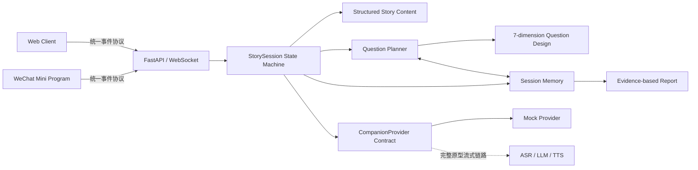

# StoryPal AI Reading Companion

> 一个融合儿童心理、教育维度、双交互引擎与会话记忆的 AI 教育互动内容产品，同时提供 Web 与微信小程序界面。

[产品逻辑](docs/product-logic.md) · [产品设计](docs/product-design.md) · [系统架构](docs/architecture.md) · [项目复盘](docs/case-study.md) · [消息协议](docs/protocol.md) · [安全边界](SECURITY.md)

## 60 秒看懂项目

StoryPal 的定位是**儿童 AI 教育互动内容系统**。它把故事内容拆成可编排的叙事节点与教育提问节点，让 AI 在合适的情节位置主动引导，同时允许孩子在任何故事句中自主打断。Memory Layer 记录本次互动证据和教育维度覆盖，帮助系统减少重复提问并保持上下文连续。

产品包含两个独立又协同的核心模块：

1. **AI 预设主动提问**：在选择、因果、情绪、知识或创意表达等剧情自然停顿处，从经过教育设计的问题池中选择问题；
2. **用户打断提问**：孩子在故事句播放时随时暂停，AI 根据当前情节与近期互动回答，再回到被打断原句。

完整原型已经跑通实时 Streaming ASR、LLM 增量输出、分句并发 Streaming TTS、PCM 音频流播放和打断恢复。公开仓库为避免暴露供应商凭证、私有配置和测试语音，保留产品 Workflow、状态机、Question Planner、session-scoped Memory Layer 与双端界面，默认改用无密钥 Mock Provider 和文字输入复现核心流程。

## 与常见儿童故事/语音陪伴产品的核心差别

| 常见形态 | StoryPal 的产品设计 |
| --- | --- |
| 核心目标是播放内容或维持对话 | 核心目标是围绕故事支持可观察的理解、推理、共情、想象和表达行为 |
| AI 在任意时机自由生成问题 | 内容团队先设计互动点、教育维度、学习目标、脚手架与略过规则 |
| 主要依赖儿童主动发问 | 同时提供 AI 主动教育引导与儿童自主打断两条路径 |
| 模型直接决定问什么、怎样教 | Question Planner 只从经过审核的候选池选择，模型负责受控回应 |
| Memory 主要用于角色熟悉感或闲聊连续性 | Memory 用于减少问题重复、保持故事语境并组织本次教育互动证据 |
| 报告偏使用时长、次数或能力分数 | 报告展示儿童原话、故事线索、互动模块和维度覆盖，不做能力诊断 |
| 低延迟是对话产品的性能指标 | 低延迟用于保护故事沉浸、工作记忆和因果链理解，服务教育互动节奏 |

教育价值通过可执行的数据结构进入系统，而非停留在产品文案：

```text
故事情节
  → 自然互动点
  → 七维问题设计卡
  → Planner 选择审核问题
  → 儿童回答 / 略过 / 主动打断
  → AI 回应或脚手架
  → 回到准确故事位置
  → Memory 记录可观察证据
  → 家长查看事实型报告
```

这个闭环覆盖两类教育需要：AI 主动提问保证儿童即使不主动开口，也能在关键情节进行思考；用户打断提问保护儿童真实好奇心和自主表达。两者共享故事语境，但使用不同的触发规则、教育维度来源和续播策略。

## 七维教育问题框架

| 维度 | 问题设计关注点 |
| --- | --- |
| 大语文 | 字词、顺序表达、修辞、文学理解与主题表达 |
| 百科知识 | 准确、具体、儿童可理解的事实与生活知识 |
| 文化理解 | 神话、历史、传统文化、地域文化和人物典故 |
| 逻辑思维 | 原因、证据、顺序、比较、选择和结果 |
| 情绪理解 | 情绪识别、原因理解、角色视角和共情 |
| 想象力 | 情节预测、反事实、角色替换和开放创造 |
| 语言表达 | 描述、复述、观点表达和完整句组织 |

每个主动问题包含触发原因、问题类型、主/副维度、学习目标、脚手架提示和追问策略。Question Planner 会优先覆盖本次会话尚未出现的维度，但不会输出儿童能力分数。

七维框架用于设计和观察学习行为：孩子是否能引用故事线索说明原因、识别角色感受、组织完整表达、预测情节或提出新的可能性。项目没有声称一次互动能提升或测定儿童能力；真正的教育效果仍需年龄分层研究、内容专家评审和长期对照验证。

## 产品决策摘要

| 产品问题 | 设计决策 | 目的 |
| --- | --- | --- |
| 孩子在播放中产生问题 | 故事句播放时开放显著的打断入口 | 降低表达时机成本 |
| AI 回答会打断叙事记忆 | 保存 `node_id + sentence_index`，回答后重播原句 | 恢复语境，避免错位续播 |
| 所有状态都允许打断会产生冲突 | 仅 `playing + story node` 开放打断 | 保持状态可预期 |
| 自由提问不足以覆盖教育目标 | 在故事中插入 `proactive_question node` | 同时支持主动探索与教育引导 |
| 主动问题容易重复 | 根据会话维度覆盖选择预设候选问题 | 保持问题多样性 |
| 互动上下文容易丢失 | Memory Layer 保存近期表达、模块来源和情节证据 | 支持连续回应和策略选择 |
| 儿童报告容易过度推断 | 只记录互动事实和维度证据 | 避免把一次互动解释为能力诊断 |
| 不同端各自管理游标容易漂移 | Backend 作为唯一状态来源 | 保证 Web 与小程序行为一致 |

完整说明见 [产品逻辑](docs/product-logic.md) 和 [产品设计](docs/product-design.md)。

## 产品界面与信息架构

| Web 体验 | 微信小程序 |
| --- | --- |
| 故事馆、互动播放器、阅读报告 | 故事馆、播放器、报告、隐私说明 |
| 浏览器语音合成、文字模拟 ASR | 定时模拟播放完成、文字模拟 ASR |
| 适合快速体验完整闭环 | 保留移动端原生触达形态和核心流程 |

所有公开示例内容均为本仓库原创，无第三方故事、封面、录音或模型权重。

```text
故事馆 → 选择故事 → 互动播放器 ─┬→ AI 主动提问 → 维度化问题 → 回答/略过 → 下一节点
                              ├→ 用户打断提问 → 语境回答 → 原句续播
                              ├→ Memory Layer → 近期互动 + 维度覆盖
                              └→ 故事结束 → 双模块互动证据报告
```

## 快速开始

需要 Python 3.10+。

```bash
python3 -m venv .venv
source .venv/bin/activate
pip install -r requirements.txt
python -m backend.app
```

打开 [http://127.0.0.1:8000](http://127.0.0.1:8000)，选择《迷路的星光》。

运行测试：

```bash
python -m unittest discover -s tests -v
```

发布前安全检查：

```bash
python scripts/check_secrets.py
```

### 微信小程序

1. 复制 `miniprogram/project.config.example.json` 为 `miniprogram/project.config.json`；
2. 填写自己的 AppID，用微信开发者工具导入 `miniprogram/`；
3. 本地调试时关闭“校验合法域名”，并保持 backend 运行；
4. 真机调试需把 `miniprogram/utils/config.js` 指向已备案的 HTTPS/WSS 域名。

真实 AppID 和 private config 已被 `.gitignore` 排除。

## 核心架构



- **Backend 持有状态**：两个客户端只上报意图与播放完成事件，故事游标由 `StorySession` 统一推进。
- **双交互独立建模**：`ai_proactive_question` 与 `user_interrupt_question` 有不同触发、上下文和续播规则。
- **问题设计结构化**：主动问题包含教育维度、学习目标、触发理由、问题类型和脚手架提示。
- **教育策略独立于模型**：模型不能临场改变学习目标，内容团队可以审核、版本化和复盘每个问题。
- **记忆参与策略**：Memory Layer 为 Question Planner 和回答 Provider 提供近期互动及维度覆盖。
- **AI 能力可替换**：工作流只依赖 `CompanionProvider.answer()`，公开版以确定性 Mock 保证可复现。
- **协议驱动跨端**：Web 与微信小程序消费同一事件，视觉实现不同，核心产品行为一致。
- **显式状态转换**：乱序消息进入 `error` 分支，降低并发播放、重复回答和错位续播风险。
- **儿童安全默认值**：只保存本次会话事实，不生成诊断分数；默认监听 `127.0.0.1`，支持立即删除会话。

详见 [系统架构](docs/architecture.md) 与 [消息协议](docs/protocol.md)。

## 低延迟与回答效果

### 已实现的实时链路

串行方案需要等待 `ASR 完成 → LLM 完成 → TTS 完成 → 播放`。完整原型把它改成重叠执行的 Streaming Pipeline：

```text
按下互动 → 本地立即停播、清队列、复用会话麦克风
                         ↓
AudioWorklet PCM → Streaming ASR → final transcript
                         ↓
LLM SSE token stream → SmartBuffer 语义分句
                         ↓
多句并发 Streaming TTS → 按句序重排 → PCM WebSocket
                         ↓
200ms jitter buffer → 边生成边播放 → 原句恢复
```

- **本地即时打断**：前端先停止 `AudioBufferSourceNode`、清空待播队列并丢弃旧音频，不等待 Backend 回包；
- **输入链路复用**：麦克风和 AudioWorklet 在 session 内保持就绪，200ms 回溯缓冲避免截掉儿童开口；
- **流式生成与分句抢跑**：LLM 以 SSE 增量返回，SmartBuffer 发现可播放短句后立即启动 TTS；
- **并发但有序**：最多三路句子 TTS 并发生成，sender queue 按 `sentence_id` 发送，兼顾速度与语序；
- **边合成边播放**：TTS 输出 PCM chunk 后立即经 WebSocket 下发，客户端以 200ms jitter buffer 换取连续播放；
- **确定内容预生成**：故事正文和主动问题按 `text_hash + voice config` 生成或命中缓存，开放回答保持实时；
- **Memory 不阻塞主链路**：会话开始时预载轻量记忆，互动后的持久化更新在回答生成后异步执行；
- **分阶段观测**：以 `session_id + turn_id + client_interaction_id` 记录 ASR、LLM 首 token、首音频包、完整 TTS 和播放状态。

### 测试证据与口径

保留的本地 PERF 日志包含 24 轮完整 LLM/TTS 记录。聚合结果如下；原始日志可能包含会话标识和互动文本，因此不进入公开仓库。

| 指标 | 样本 | min | p50 | p90 | max |
| --- | ---: | ---: | ---: | ---: | ---: |
| LLM 首 token | 24 | 431ms | 590ms | 797ms | 999ms |
| LLM 开始到全部回答音频发送完 | 24 | 2531ms | 3204ms | 4183ms | 4463ms |

首个回答音频包在 `round_end` 前到达，说明 LLM、TTS 和播放已经形成流水线；第二项是完整音频发送耗时，不能当作首段出声时间。当前日志对首音频只记录事件、没有统一的 server elapsed 字段，因此不把 `<1.5s` 写成已验证结论。ASR 总耗时包含儿童实际说话时长，也不能直接解释为识别引擎延迟。

### 如何平衡速度与效果

- 主动提问使用人审候选和预生成音频，把教育目标、时机与安全性前置；
- 自由提问只携带当前故事上下文和少量相关 Memory，减少 token，同时避免上下文失焦；
- 回答先给核心结论，再连接故事证据，必要时只加一个追问，避免长回答抢占故事；
- 知识与高风险问题需要事实包、强审核或安全降级，安全门槛高于最低延迟目标；
- Streaming 输出不能逐 token 直接进扬声器，下一步应以完整句作为审核和 TTS 的最小单位。

这套实现仍有清晰的工程欠账：SmartBuffer 的 30 字合并阈值会拖慢短回答首段；LLM 预连接任务需要补齐取消与异常回收；二进制音频帧缺少 `response_id`；临时公网 Tunnel 不适合作为性能基准。完整分析见[系统架构：实时回答链路](docs/architecture.md#9-实时回答链路与延迟预算)。

回答效果不以单一模型分数判断，而是联合关注首段延迟、完整回答耗时、故事事实一致性、年龄可理解性、安全拦截率、澄清率、打断恢复成功率和儿童继续互动率。

## 关键工程架构决策

| 决策 | 解决的问题 | 取舍 |
| --- | --- | --- |
| Backend 持有权威游标 | 多端计时与网络抖动导致续播错位 | 服务端需要维护 session 状态 |
| 显式有限状态机 | 打断、回答、续播和略过消息可能乱序 | 新状态必须同步更新协议与测试 |
| WebSocket command/event 协议 | 双向实时控制和跨端一致 | 生产版还需序号、幂等和重连恢复 |
| Streaming 分句并发＋按序发送 | 把 LLM、TTS 和播放重叠执行 | 需要处理分句阈值、背压和迟到 chunk |
| 200ms jitter buffer | 降低公网抖动造成的破音和断续 | 主动增加少量首段延迟 |
| 内容、编排、Provider 分层 | 更换模型供应商时保留产品逻辑 | 公开 contract 为一次性文本，完整原型采用事件流 |
| 预设问题池＋Planner | 教育目标、时机和安全性可审阅 | 开放性低于完全自由生成 |
| Session-scoped Memory | 保持上下文，同时控制儿童隐私风险 | 暂不支持跨会话个性化 |
| 按句恢复 | 跨 TTS Provider 稳定恢复 | 精度低于音素或毫秒级恢复 |
| Mock-first 公开版 | 无密钥复现完整 Workflow | 不能代表线上模型效果和延迟 |

工程难点集中在：儿童语音端点检测、Streaming ASR 结果反复修订、模型流式输出与安全审核冲突、播放取消和迟到事件、打断后的精确恢复、短上下文与连续感平衡，以及教育效果缺少可即时验证的统一标准。详见[项目复盘](docs/case-study.md#8-工程难点与解决路径)。

## 我负责的部分

- **产品定义**：从儿童听故事场景定义“打断—回答—续播”的核心体验、边界与成功条件；
- **儿童内容设计**：建立大语文、百科、文化、逻辑、情绪、想象力、表达七维问题框架；
- **产品逻辑**：设计 AI 主动提问与用户打断提问两套模块、恢复规则、脚手架和略过机制；
- **教育产品化**：把儿童心理与教育原则转成七维 schema、问题设计卡、Planner 规则、互动证据和报告口径；
- **系统设计**：设计 node/sentence/question 数据模型、Question Planner、Memory Layer、统一协议和 provider contract；
- **实时 Pipeline**：实现 Streaming ASR、LLM 增量分句、并发 Streaming TTS、有序音频队列、jitter buffer 与低延迟打断；
- **交互设计**：实现 Web 与微信小程序的信息架构、关键状态反馈、移动端播放器与报告页面；
- **AI Workflow 交付**：完成端到端可运行原型、测试和公开仓库工程化；
- **公开合规**：移除密钥、真实 AppID、第三方素材和供应商实现，改为原创内容与 Mock-first 演示。

项目过程与取舍见 [项目复盘](docs/case-study.md)。

## 当前边界

- 完整原型已验证真实 ASR、LLM、TTS 的流式链路；公开仓库移除了供应商 adapter、凭证、测试音频和原始日志；
- 现有 PERF 样本可支持 LLM 首 token 和完整发送耗时结论，尚不足以支持严格的公网端到端 SLA；
- 浏览器语音合成的音色由操作系统决定；微信小程序演示用定时器模拟播放完成；
- Memory Layer 只在本次进程内保存互动证据，不提供跨会话画像；
- 报告呈现双模块次数和维度证据，不做儿童心理、智力或教育诊断；
- 生产化仍需账户体系、监护人同意、数据删除、内容审核、限流与可观测性。

## 仓库结构

```text
backend/          FastAPI、双交互状态机、Question Planner、Memory Layer
web-client/       零构建依赖的 Web 演示
miniprogram/      微信小程序前端（四个页面）
stories/          原创结构化示例故事
tests/            双模块、记忆、问题规划、恢复和异常顺序测试
docs/             产品逻辑、产品设计、架构、协议与项目复盘
```

## License

代码以 [MIT License](LICENSE) 发布。原创故事文本仅用于演示，也包含在该许可范围内。

## English summary

StoryPal is a cross-platform AI educational content system with two interaction engines: memory-aware proactive questions designed across seven educational dimensions, and child-initiated interruption questions that resume from the exact story sentence. The full prototype ran a streaming ASR → incremental LLM → concurrent streaming TTS pipeline; the public edition replaces vendor adapters with a key-free Mock Provider while retaining the Question Planner, session-scoped Memory Layer, evidence-based report, Web and WeChat Mini Program clients, and tests.
