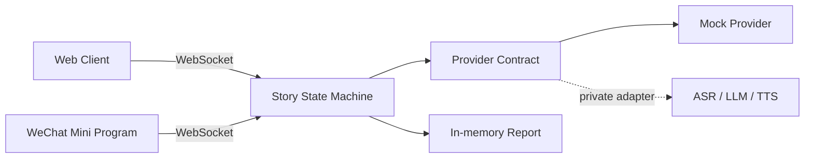

# StoryPal AI Reading Companion

> 一个支持“随时打断—语境回答—原句续播—互动报告”的儿童 AI 互动阅读工作流，同时提供 Web 与微信小程序界面。

[English summary](#english-summary) · [架构](docs/architecture.md) · [消息协议](docs/protocol.md) · [安全边界](SECURITY.md)

## 60 秒看懂项目

StoryPal 解决有声故事的一个具体问题：播放通常是单向的，孩子在听故事时产生的问题和想法无法进入内容流程。

这个公开版把核心闭环做成可运行的状态机：

1. 播放到任意句时，孩子可以主动打断；
2. 系统保存 `node_id + sentence_index`，进入倾听态；
3. AI provider 基于当前故事语境回答；
4. 回答完成后回到被打断的原句继续；
5. 主动打断和引导式回答进入事实型互动报告。

公开仓库默认运行 Mock provider，不需要模型密钥。浏览器用 `SpeechSynthesis` 演示朗读，文字输入模拟 ASR，便于任何人复现产品流程。

## 产品界面

| Web 体验 | 微信小程序 |
| --- | --- |
| 故事馆、互动播放器、阅读报告 | 故事馆、播放器、报告、隐私说明 |
| 可直接通过本地浏览器演示 | 保留原型的跨端产品形态和核心流程 |

所有公开示例内容均为本仓库原创，无第三方故事、封面、录音或模型权重。

## 快速开始

需要 Python 3.10+。

```bash
python3 -m venv .venv
source .venv/bin/activate
pip install -r requirements.txt
python -m backend.app
```

打开 [http://127.0.0.1:8000](http://127.0.0.1:8000)，选择《迷路的星光》。

运行测试：

```bash
python -m unittest discover -s tests -v
```

### 微信小程序

1. 复制 `miniprogram/project.config.example.json` 为 `miniprogram/project.config.json`；
2. 填写自己的 AppID，用微信开发者工具导入 `miniprogram/`；
3. 本地调试时关闭“校验合法域名”，并保持 backend 运行；
4. 真机调试需把 `miniprogram/utils/config.js` 指向已备案的 HTTPS/WSS 域名。

真实 AppID 和 private config 已被 `.gitignore` 排除。

## 架构与设计取舍



- **前端不管理故事状态**：两个客户端只发送意图和播放完成事件，续播位置由 backend 决定。
- **AI 能力可替换**：产品工作流依赖 `CompanionProvider`，公开版默认实现为确定性的 Mock。
- **显式状态转换**：乱序消息会返回可解释错误，避免并发播放、重复回答和错位续播。
- **本地优先**：默认只监听 `127.0.0.1`；公开演示不上传录音，也不持久化儿童数据。

详见 [docs/architecture.md](docs/architecture.md) 与 [docs/protocol.md](docs/protocol.md)。

## 我负责的部分

- 从儿童内容消费场景定义“打断—回答—续播”的核心体验；
- 设计故事 node/sentence 数据模型和 WebSocket 消息协议；
- 搭建可替换的 AI provider 边界及端到端状态机；
- 实现 Web 与微信小程序两端原型和互动报告；
- 将内部实验整理为无密钥、无第三方素材、可复现的公开作品集版本。

## 当前边界

- 公开版验证的是 Workflow 编排与交互体验，不代表 ASR、LLM、TTS 的线上效果；
- 浏览器语音合成的音色由操作系统决定；微信小程序演示用定时器模拟播放完成；
- 报告只呈现互动事实，不做儿童心理、智力或教育诊断；
- 内存会话不适合生产部署，服务重启后报告会被清空；
- 生产化仍需账户体系、监护人同意、数据删除、内容审核、限流与可观测性。

## 仓库结构

```text
backend/          FastAPI、状态机、provider contract
web-client/       零构建依赖的 Web 演示
miniprogram/      微信小程序前端（四个页面）
stories/          原创结构化示例故事
tests/            核心流程与异常顺序测试
docs/             架构与 WebSocket 协议
```

## License

代码以 [MIT License](LICENSE) 发布。原创故事文本仅用于演示，也包含在该许可范围内。

## English summary

StoryPal is a cross-platform AI reading workflow that lets a child interrupt any sentence, ask a contextual question, receive an answer, and resume from the exact interruption point. This public portfolio edition ships with a deterministic mock provider, an original demo story, a Web client, a WeChat Mini Program client, and tests—without API keys or third-party media.
