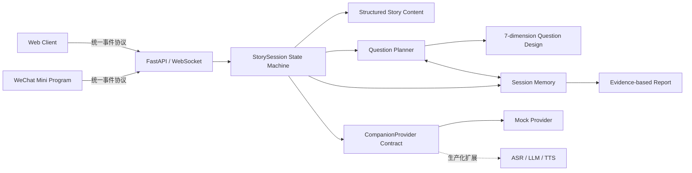

# StoryPal AI Reading Companion

> 一个融合儿童心理、教育维度、双交互引擎与会话记忆的 AI 教育互动内容产品，同时提供 Web 与微信小程序界面。

[产品逻辑](docs/product-logic.md) · [产品设计](docs/product-design.md) · [系统架构](docs/architecture.md) · [项目复盘](docs/case-study.md) · [消息协议](docs/protocol.md) · [安全边界](SECURITY.md)

## 60 秒看懂项目

StoryPal 解决的不只是语音播放问题。它把故事内容拆成可编排的叙事节点与教育提问节点，让 AI 在合适的情节位置主动引导，同时允许孩子在任何故事句中自主打断。Memory Layer 记录本次互动证据和教育维度覆盖，帮助系统减少重复提问并保持上下文连续。

产品包含两个独立又协同的核心模块：

1. **AI 预设主动提问**：在选择、因果、情绪、知识或创意表达等剧情自然停顿处，从经过教育设计的问题池中选择问题；
2. **用户打断提问**：孩子在故事句播放时随时暂停，AI 根据当前情节与近期互动回答，再回到被打断原句。

公开版已经实现 Question Planner、session-scoped Memory Layer、双模块状态机、维度化报告和立即删除接口。默认运行 Mock provider，不需要模型密钥；文字输入模拟 ASR，便于复现产品架构和交互流程。

## 七维教育问题框架

| 维度 | 问题设计关注点 |
| --- | --- |
| 大语文 | 字词、顺序表达、修辞、文学理解与主题表达 |
| 百科知识 | 准确、具体、儿童可理解的事实与生活知识 |
| 文化理解 | 神话、历史、传统文化、地域文化和人物典故 |
| 逻辑思维 | 原因、证据、顺序、比较、选择和结果 |
| 情绪理解 | 情绪识别、原因理解、角色视角和共情 |
| 想象力 | 情节预测、反事实、角色替换和开放创造 |
| 语言表达 | 描述、复述、观点表达和完整句组织 |

每个主动问题包含触发原因、问题类型、主/副维度、学习目标、脚手架提示和追问策略。Question Planner 会优先覆盖本次会话尚未出现的维度，但不会输出儿童能力分数。

## 产品决策摘要

| 产品问题 | 设计决策 | 目的 |
| --- | --- | --- |
| 孩子在播放中产生问题 | 故事句播放时开放显著的打断入口 | 降低表达时机成本 |
| AI 回答会打断叙事记忆 | 保存 `node_id + sentence_index`，回答后重播原句 | 恢复语境，避免错位续播 |
| 所有状态都允许打断会产生冲突 | 仅 `playing + story node` 开放打断 | 保持状态可预期 |
| 自由提问不足以覆盖教育目标 | 在故事中插入 `proactive_question node` | 同时支持主动探索与教育引导 |
| 主动问题容易重复 | 根据会话维度覆盖选择预设候选问题 | 保持问题多样性 |
| 互动上下文容易丢失 | Memory Layer 保存近期表达、模块来源和情节证据 | 支持连续回应和策略选择 |
| 儿童报告容易过度推断 | 只记录互动事实和维度证据 | 避免把一次互动解释为能力诊断 |
| 不同端各自管理游标容易漂移 | Backend 作为唯一状态来源 | 保证 Web 与小程序行为一致 |

完整说明见 [产品逻辑](docs/product-logic.md) 和 [产品设计](docs/product-design.md)。

## 产品界面与信息架构

| Web 体验 | 微信小程序 |
| --- | --- |
| 故事馆、互动播放器、阅读报告 | 故事馆、播放器、报告、隐私说明 |
| 浏览器语音合成、文字模拟 ASR | 定时模拟播放完成、文字模拟 ASR |
| 适合快速体验完整闭环 | 保留移动端原生触达形态和核心流程 |

所有公开示例内容均为本仓库原创，无第三方故事、封面、录音或模型权重。

```text
故事馆 → 选择故事 → 互动播放器 ─┬→ AI 主动提问 → 维度化问题 → 回答/略过 → 下一节点
                              ├→ 用户打断提问 → 语境回答 → 原句续播
                              ├→ Memory Layer → 近期互动 + 维度覆盖
                              └→ 故事结束 → 双模块互动证据报告
```

## 快速开始

需要 Python 3.10+。

```bash
python3 -m venv .venv
source .venv/bin/activate
pip install -r requirements.txt
python -m backend.app
```

打开 [http://127.0.0.1:8000](http://127.0.0.1:8000)，选择《迷路的星光》。

运行测试：

```bash
python -m unittest discover -s tests -v
```

发布前安全检查：

```bash
python scripts/check_secrets.py
```

### 微信小程序

1. 复制 `miniprogram/project.config.example.json` 为 `miniprogram/project.config.json`；
2. 填写自己的 AppID，用微信开发者工具导入 `miniprogram/`；
3. 本地调试时关闭“校验合法域名”，并保持 backend 运行；
4. 真机调试需把 `miniprogram/utils/config.js` 指向已备案的 HTTPS/WSS 域名。

真实 AppID 和 private config 已被 `.gitignore` 排除。

## 核心架构



- **Backend 持有状态**：两个客户端只上报意图与播放完成事件，故事游标由 `StorySession` 统一推进。
- **双交互独立建模**：`ai_proactive_question` 与 `user_interrupt_question` 有不同触发、上下文和续播规则。
- **问题设计结构化**：主动问题包含教育维度、学习目标、触发理由、问题类型和脚手架提示。
- **记忆参与策略**：Memory Layer 为 Question Planner 和回答 Provider 提供近期互动及维度覆盖。
- **AI 能力可替换**：工作流只依赖 `CompanionProvider.answer()`，公开版以确定性 Mock 保证可复现。
- **协议驱动跨端**：Web 与微信小程序消费同一事件，视觉实现不同，核心产品行为一致。
- **显式状态转换**：乱序消息进入 `error` 分支，降低并发播放、重复回答和错位续播风险。
- **儿童安全默认值**：只保存本次会话事实，不生成诊断分数；默认监听 `127.0.0.1`，支持立即删除会话。

详见 [系统架构](docs/architecture.md) 与 [消息协议](docs/protocol.md)。

## 我负责的部分

- **产品定义**：从儿童听故事场景定义“打断—回答—续播”的核心体验、边界与成功条件；
- **儿童内容设计**：建立大语文、百科、文化、逻辑、情绪、想象力、表达七维问题框架；
- **产品逻辑**：设计 AI 主动提问与用户打断提问两套模块、恢复规则、脚手架和略过机制；
- **系统设计**：设计 node/sentence/question 数据模型、Question Planner、Memory Layer、统一协议和 provider contract；
- **交互设计**：实现 Web 与微信小程序的信息架构、关键状态反馈、移动端播放器与报告页面；
- **AI Workflow 交付**：完成端到端可运行原型、测试和公开仓库工程化；
- **公开合规**：移除密钥、真实 AppID、第三方素材和供应商实现，改为原创内容与 Mock-first 演示。

项目过程与取舍见 [项目复盘](docs/case-study.md)。

## 当前边界

- 公开版验证的是 Workflow 编排与交互体验，不代表 ASR、LLM、TTS 的线上效果；
- 浏览器语音合成的音色由操作系统决定；微信小程序演示用定时器模拟播放完成；
- Memory Layer 只在本次进程内保存互动证据，不提供跨会话画像；
- 报告呈现双模块次数和维度证据，不做儿童心理、智力或教育诊断；
- 生产化仍需账户体系、监护人同意、数据删除、内容审核、限流与可观测性。

## 仓库结构

```text
backend/          FastAPI、双交互状态机、Question Planner、Memory Layer
web-client/       零构建依赖的 Web 演示
miniprogram/      微信小程序前端（四个页面）
stories/          原创结构化示例故事
tests/            双模块、记忆、问题规划、恢复和异常顺序测试
docs/             产品逻辑、产品设计、架构、协议与项目复盘
```

## License

代码以 [MIT License](LICENSE) 发布。原创故事文本仅用于演示，也包含在该许可范围内。

## English summary

StoryPal is a cross-platform AI educational content system with two interaction engines: memory-aware proactive questions designed across seven educational dimensions, and child-initiated interruption questions that resume from the exact story sentence. The public edition includes a Question Planner, session-scoped Memory Layer, evidence-based report, Web and WeChat Mini Program clients, and tests—without API keys or third-party media.
