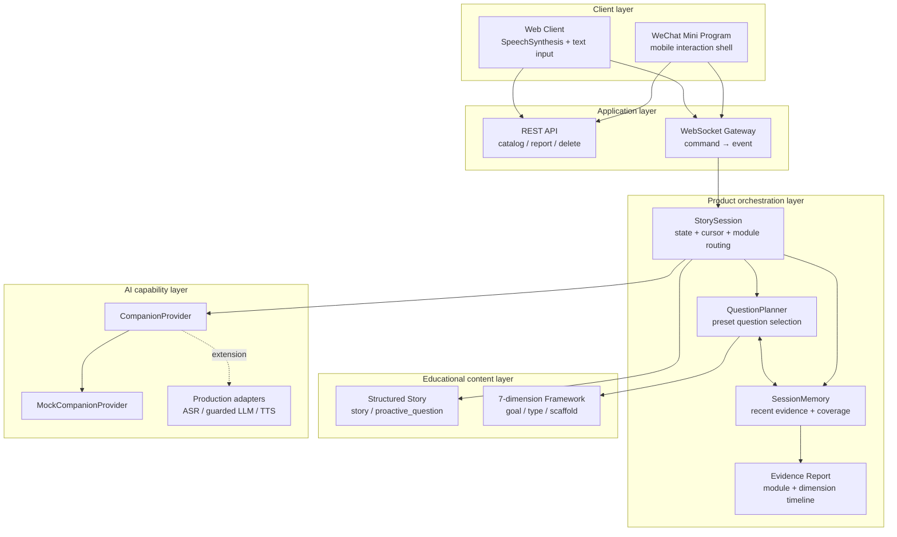
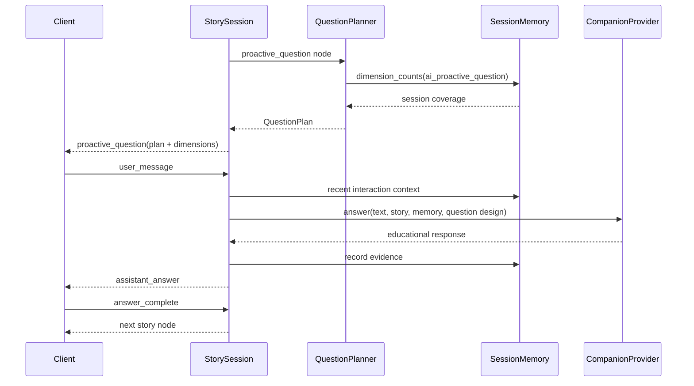
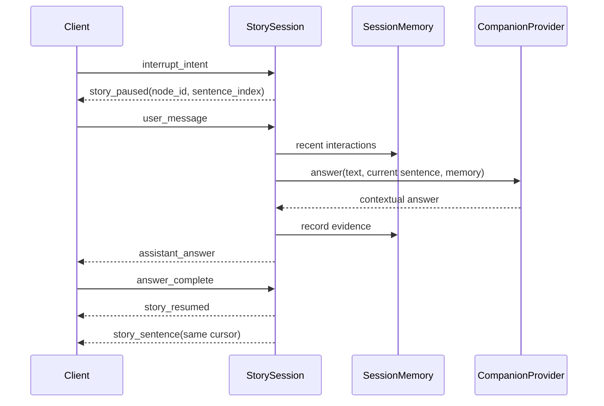
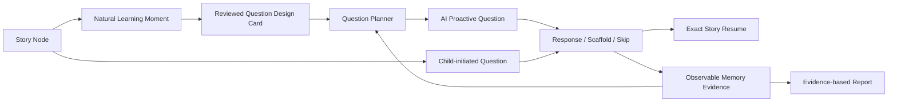
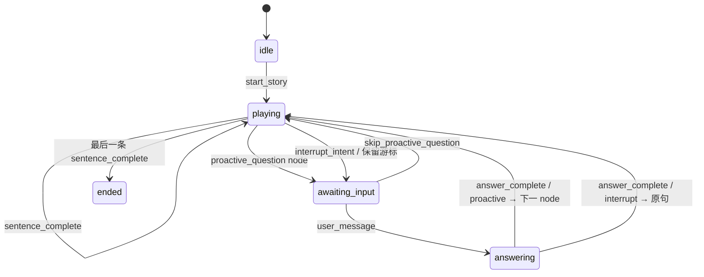
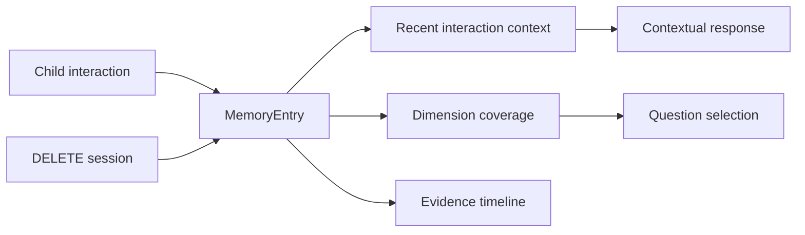
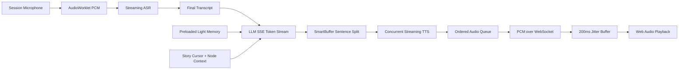

# System architecture

## 1. 架构目标

系统架构服务于六个产品要求：

1. AI 能在经过内容设计的剧情节点主动提问；
2. 孩子能在任意故事句播放时自主打断；
3. 回答后准确恢复到对应故事位置；
4. 主动问题能结合本次互动记忆减少维度重复；
5. Web 与微信小程序遵循同一套产品规则；
6. 更换 ASR、LLM、TTS 供应商时不重写教育内容和状态机。

## 2. 模块视图



| 模块 | 当前职责 | 有意不承担的职责 |
| --- | --- | --- |
| Web / Mini Program | 呈现、输入、播放完成、略过 | 决定权威游标或教育策略 |
| FastAPI REST | 故事目录、报告读取、会话删除 | 故事状态推进 |
| WebSocket Gateway | command/event 转换与连接隔离 | 供应商业务逻辑 |
| `StorySession` | 状态、游标、双模块路由、恢复规则 | UI 表现和模型 SDK 细节 |
| `QuestionPlanner` | 从预设候选中选择本轮主动问题 | 临场自由生成教育问题 |
| `SessionMemory` | 本次会话事实、近期互动、维度覆盖 | 诊断标签和长期儿童画像 |
| Story JSON | 叙事、问题池、目标、触发、脚手架 | 客户端布局 |
| `CompanionProvider` | 根据当前故事与记忆上下文回应 | 控制故事游标 |
| Evidence Report | 双模块次数、维度证据、时间线 | 能力或心理评分 |

## 3. 双交互引擎

### AI 预设主动提问



主动问题只从内容编辑者设计的候选池中选择。Planner 使用本次会话的维度覆盖做低风险个性化，不允许模型脱离故事临场制造教学目标。

每个候选问题包含：

```text
question_id
prompt
primary_dimension
dimensions
question_type
learning_goal
scaffold_prompt
trigger_reason
follow_up_policy
```

### 用户打断提问



打断模块从孩子真实问题推断本轮响应维度。它不改变主动问题池，也不推进当前游标；回答完成后重播原句。

| 规则 | AI 主动提问 | 用户打断提问 |
| --- | --- | --- |
| 发起者 | 系统 | 孩子 |
| 触发条件 | 到达 `proactive_question node` | `playing + story node` |
| 教育维度 | 内容设计时预设，Planner 选择 | 根据孩子本次表达分类 |
| 上下文 | 问题目标、当前情节、会话记忆 | 当前句、近期互动记忆 |
| 可否略过 | 可以 | 不适用 |
| 回答后 | 下一 node | 回到被打断原句 |

### 教育目标如何进入执行链路

这两条路径都能调用 AI，但承担不同的教育职责：



- 主动模块的教育维度和学习目标来自内容 schema，模型不能临场替换；
- 打断模块先识别儿童真实问题属于知识、情绪、想象、逻辑还是表达方向，再组织故事内回应；
- “不知道”进入脚手架策略，把任务缩小成选择、观察线索或完成半句话；
- 略过是合法路径，避免把教育互动变成强制测验；
- 续播精确回到原句，用于降低情境切换带来的工作记忆负担；
- Memory 记录互动事实，为后续问题选择和家长报告提供可追溯证据。

架构把“教育策略”和“模型生成能力”分开：内容与 Planner 决定为什么问、何时问、关注什么；Provider 决定怎样用适龄语言回应。这样更换模型不会同时改变教学目标。

## 4. 单一状态来源

`StorySession` 是故事进度的唯一真相来源。客户端只报告事实或意图：

- `sentence_complete`：当前故事句播放完；
- `interrupt_intent`：孩子希望暂停并表达；
- `user_message`：已经得到儿童输入文本；
- `skip_proactive_question`：略过系统主动问题；
- `answer_complete`：AI 回答播放完。

续播位置由 backend 保存的 `node_index + sentence_index` 决定，避免不同客户端计时器、网络延迟和重渲染造成游标漂移。

## 5. 状态机



| 当前状态 | 合法 command | 结果 |
| --- | --- | --- |
| `idle` | `start_story` | 创建 session 与 session memory |
| `playing` + story | `sentence_complete` | 下一句、下一 node 或结束 |
| `playing` + story | `interrupt_intent` | 游标不变，进入用户打断模块 |
| `awaiting_input` + proactive | `skip_proactive_question` | 记录略过事实并进入下一 node |
| `awaiting_input` | `user_message` | 调用 Provider，写入记忆 |
| `answering` + proactive | `answer_complete` | 推进下一 node |
| `answering` + interrupt | `answer_complete` | `story_resumed` 后重发原句 |

非法顺序转成 `error` event，避免重复完成、回答期间再次打断和未开始就推进。

## 6. Memory Layer



### 当前公开版实现

`SessionMemory` 只存在于 Python 进程内，每条 `MemoryEntry` 包含：

- `interaction_module`：主动提问或打断提问；
- `node_id` 与当前情节摘要；
- 儿童原始表达和 AI 回答；
- 教育维度与输入分类；
- 回答/略过状态和时间。

它支持三种读取方式：

1. Provider 获取最近三条互动，保持对话连续；
2. Question Planner 获取主动问题维度覆盖，减少重复；
3. Report 获取双模块次数、维度证据和完整时间线。

### 儿童记忆分层

| 层级 | 当前公开版 | 生产化边界 |
| --- | --- | --- |
| 故事工作记忆 | 当前 node、sentence、情节上下文 | 可加入实体与事件图谱 |
| 单次会话记忆 | 已实现，进程内保存 | 可增加 TTL 与幂等写入 |
| 教育策略记忆 | 本次维度覆盖 | 长期使用需证据阈值和人工评审 |
| 跨会话儿童记忆 | 未实现 | 必须有监护人同意、查看、删除和关闭 |

公开版没有 `ability_score`。维度计数只表示“本次出现过多少条互动证据”，不能代表儿童稳定能力。

## 7. 教育内容模型

故事有两类 node：

```json
{"id":"forest-night","type":"story","sentences":["第一句","第二句"]}
```

```json
{
  "id": "first-thought",
  "type": "proactive_question",
  "question_design": {
    "trigger_reason": "剧情自然停顿处",
    "selection_policy": "least_exposed_dimension_in_session",
    "candidates": [
      {
        "question_id": "emotion-question",
        "prompt": "小星星现在可能是什么心情？为什么？",
        "primary_dimension": "emotional_understanding",
        "dimensions": ["emotional_understanding", "logic"],
        "question_type": "emotion_and_reason",
        "learning_goal": "识别角色情绪，并用故事线索说明原因。",
        "scaffold_prompt": "可以从害怕或着急里选一个。"
      }
    ]
  }
}
```

按句切分支持打断定位、进度计算和 TTS 控制。主动问题独立成 node，避免把提问写进故事正文，也让内容团队可以单独审阅问题时机和教育目标。

## 8. Provider contract

状态机依赖的产品级 contract：

```python
async def answer(
    child_text: str,
    story_context: str,
    interaction_context: dict | None = None,
) -> str: ...
```

`interaction_context` 包含模块类型、输入分类、维度、脚手架和近期互动记忆。公开版 `MockCompanionProvider` 输出确定性回答；真实 adapter 应在外围加入年龄约束、输入输出审核、超时和降级。

这个 contract 是公开作品集版的一次性文本兼容层。原完整原型已经使用事件流完成实时语音 Pipeline：LLM 输出 `text delta`，SmartBuffer 产出完整句，TTS 产出 PCM chunk，再通过 WebSocket 二进制帧进入客户端播放。若把完整实现产品化，仍应将隐式事件正式收敛为 `answer_stream() -> AsyncIterator[AnswerEvent]`，并明确 `text_delta`、`sentence_ready`、`audio_chunk`、`safety_blocked`、`completed` 和 `failed`。

## 9. 实时回答链路与延迟预算

### 9.1 两个版本的边界

| 版本 | 已实现内容 | 公开策略 |
| --- | --- | --- |
| 完整原型 | Streaming ASR、真实 LLM SSE、SmartBuffer、并发 Streaming TTS、PCM WebSocket、jitter buffer、预制故事音频、打断恢复和 PERF 埋点 | 含供应商 adapter、私有配置和测试数据，不直接公开 |
| 本公开仓库 | 双交互状态机、Question Planner、session Memory、跨端协议和报告 | Mock Provider＋文字输入，无密钥可复现 |

公开版用于证明产品编排和安全边界；下面的实时链路来自已运行的完整原型和保留代码审计。

### 9.2 已实现的 Streaming Pipeline



工程实现中的关键决策：

1. **本地先停播**：按下互动后立即停止 active audio source、清队列并进入“我在听”，不把网络 RTT 放进操作反馈；
2. **会话内复用采集链路**：麦克风和 AudioWorklet 保持就绪；200ms backtrack buffer 保护开头音节；
3. **Streaming ASR＋信号归属**：音频持续上行，`speech_end` 可早到并进入 backlog；用 `turn_id` 与 `client_interaction_id` 过滤过期控制信号；
4. **LLM 增量分句**：SSE token 进入 SmartBuffer，命中短语或标点后把可播句提交 TTS，无需等待完整回答；
5. **TTS 并发、发送有序**：三路句子 TTS 并发，`sentence_id` 和 sender queue 保证语音仍按原顺序播放；
6. **PCM 边产边播**：每个 TTS audio chunk 立即下发，客户端积累 200ms 后连续调度 Web Audio；
7. **确定内容与开放内容分流**：故事节点及主动问题使用预生成/首播缓存，按 `text_hash + voice config` 校验；自由回答实时生成；
8. **Memory 移出关键路径**：session 建立时 preload，回答结束后用后台任务写入，避免阻塞 ASR → LLM → TTS；
9. **旧音频失效**：打断时本地进入 discard window，旧 PCM 即使迟到也不再入播放队列。

### 9.3 体验目标与测量口径

保留的本地结构化日志包含 24 轮完整 LLM/TTS 记录：

| 指标 | min | p50 | p90 | max | 结论边界 |
| --- | ---: | ---: | ---: | ---: | --- |
| `llm_first_token_ms` | 431 | 590 | 797 | 999 | 真实供应商本地测试样本 |
| `llm_tts_ms` | 2531 | 3204 | 4183 | 4463 | LLM 开始到全部音频发送完，非首音频延迟 |

日志同时记录首个回答音频包在完整 `round_end` 之前到达，验证了边生成边播放。由于现有 `answer_audio_first_packet` 缺少统一的 server elapsed 字段，不能从这些日志精确计算 endpoint-to-first-audio。ASR 的 `elapsed_ms` 包含儿童说话时间，也不能作为 ASR 引擎耗时。

下一轮观测应增加 `asr_endpoint_at`、`first_sentence_ready_at`、`tts_first_chunk_at` 和 `audio_first_play_at`，以同一 monotonic clock 计算端到端指标；跨客户端和服务端的绝对时间需要时钟校准。操作反馈 `<300ms`、endpoint 后首段语音 `<1.5s` 可以保留为验收目标，不能与现有 LLM TTFT 数据混写。

## 10. 回答效果与速度的平衡

### 分层路由

| 请求类型 | 默认路径 | 速度与质量策略 |
| --- | --- | --- |
| AI 主动提问 | 审核问题池＋预生成音频 | 最稳定、最低延迟，不调用模型生成问题 |
| 故事情节理解 | 小模型或主模型＋当前 node 事实 | 短上下文、直接回答、限制在故事证据内 |
| 开放想象与表达 | 低温度对话模型 | 接纳多个答案，以一条追问结束 |
| 百科知识 | 检索事实包＋模型表述 | 无可靠来源时承认不确定并缩小问题 |
| 情绪与敏感内容 | 强审核模型或规则升级 | 安全优先，不追求最低首包延迟 |

### 回答结构

默认回答控制在 2–4 句：第一句回应儿童问题，第二句连接故事证据，必要时第三句提出一个低压力追问。长知识说明按需继续，避免为了“完整”让孩子等待或打断故事节奏。

### Streaming 与安全

逐 token 直接进入扬声器延迟最低，但任何已经播放的内容都无法撤回。完整原型目前用 SmartBuffer 在句子/短语边界启动 TTS，尚未实现独立的流式安全闸门。产品化方案应以完整句作为最小审核和 TTS 单位：普通请求保留一条句级缓冲，高风险请求等待完整回答或使用安全模板。安全门槛高于首段延迟目标。

### 双目标评估

延迟指标和质量指标需要同时进入实验看板：

- 性能：操作反馈、endpoint、首 token、首个安全句、首段音频、完整耗时、超时率；
- 质量：故事事实一致性、年龄可理解性、回答相关性、重复率、澄清率、安全拦截准确性；
- 体验：打断恢复成功率、回答被二次打断率、主动问题略过率、儿童继续表达率；
- 教育：只观察可验证行为和互动证据，不用一次回答推断稳定能力。

## 11. 工程架构决策

| 决策 | 原因 | 代价与后续 |
| --- | --- | --- |
| Backend 是进度唯一真相来源 | 消除 Web、小程序和音频时钟的游标分歧 | 需要 session 恢复与水平扩展方案 |
| 有限状态机管理生命周期 | 明确打断、输入、回答、续播的合法顺序 | 新功能必须定义状态转移和异常路径 |
| WebSocket command/event 协议 | 支持双向实时控制和跨端复用 | 已有 `turn_id` 和 `client_interaction_id`；仍需 `seq`、ack、幂等与重连 |
| 内容层与 AI Provider 分离 | 教学目标不绑定模型供应商 | 需要维护稳定 contract 和 adapter 测试 |
| 主动问题池由人审、Planner 选择 | 兼顾低延迟、教育目标与安全性 | 灵活性低于完全生成式方案 |
| 教育策略与模型 Provider 分离 | 教学目标可审核、版本化和复盘 | 内容团队需要维护问题 schema 与质量标准 |
| Memory 只提供最小相关上下文 | 降低 token、延迟和隐私风险 | 长期个性化必须另建同意与治理机制 |
| 按句保存恢复点 | 跨浏览器和 TTS Provider 都可解释 | 无法从被打断句的毫秒位置继续 |
| SmartBuffer＋并发 TTS＋有序发送 | 重叠 LLM、TTS 和播放，同时避免语序错乱 | 分句阈值与队列背压需要持续调优 |
| 200ms jitter buffer | 吸收公网 PCM 抖动，降低破音 | 以固定的 200ms 起播成本换连续性 |

完整原型已有每轮 `turn_id`、轻量 `client_interaction_id` 和结构化 PERF tracing。产品化还需要：WebSocket sticky session 或外部 session store、音频帧级 `response_id`、命令幂等、背压控制、断线重连、Provider circuit breaker，以及不记录儿童原文的隐私化日志。

## 12. 主要工程难点

1. **分句粒度**：句子太短会产生大量 TTS 建连和破碎听感，太长又拖慢首段；现有 SmartBuffer 的 30 字阈值已经被识别为首段瓶颈，下一步应改为“语义边界＋最大等待时间”双阈值；
2. **并发与顺序**：多句 TTS 并发能降耗时，但后完成的前句会阻塞后续音频；sender queue 解决乱序，仍需队列水位和 timeout；
3. **儿童语音识别**：流式结果会修订、儿童语速与停顿差异大；项目加入最佳候选回退、重复清理、故事词表纠错和 `speech_end backlog`；
4. **流式安全**：模型生成速度可能快于审核，已经播出的语音无法收回；当前尚缺句级安全 Gate，是上线前必须补齐的能力；
5. **取消与迟到事件**：项目已有本地清队列、discard window、`turn_id` 和 `client_interaction_id`，但原始二进制音频帧还没有 `response_id`；
6. **精确恢复**：打断发生在客户端音频时钟，权威游标在服务端；最终选择上报真实起播的 `node_id + sentence_index`，避免用“已到达客户端”误判为“已经播放”；
7. **上下文取舍**：完整历史增加延迟、成本和隐私暴露；Light Memory 采用 preload＋小窗口读取，并把更新放到回答后的后台任务；
8. **观测口径**：ASR 总时间包含儿童说话时长，完整 TTS 时间也不等于首音频；必须分解阶段并使用统一时钟；
9. **公网基准**：个人 Mac＋临时 Tunnel 会引入 DNS、TLS 和跨网抖动，只能做功能 Demo，不能作为正式 SLA。

## 13. 教育价值的工程化表达

项目没有把“教育”定义为多加几个 Prompt 关键词，而是把教育决策分配到不同模块：

| 教育问题 | 工程承载模块 | 可验证产物 |
| --- | --- | --- |
| 为什么此处要停下来问 | Story node 与 `trigger_reason` | 情节位置和设计理由 |
| 希望儿童进行什么思考 | `learning_goal`、主/副维度、`question_type` | 可观察行为目标 |
| 问题是否适龄且开放 | 审核候选池与问题设计卡 | 可人工审阅的内容数据 |
| 儿童不知道怎么办 | `scaffold_prompt` 与略过状态 | 脚手架使用和略过事实 |
| 如何尊重儿童主动性 | `user_interrupt_question` 独立模块 | 儿童真实问题及故事上下文 |
| 如何避免重复提问 | Memory coverage＋Question Planner | 选择理由和维度分布 |
| 如何向家长解释价值 | Evidence-based Report | 儿童原话、AI 回应和故事证据 |
| 如何避免过度判断 | 不设置 `ability_score` | 无心理或能力诊断字段 |

低延迟也属于教育体验的一部分：打断后的长等待会破坏共同注意和故事因果链，错误续播会增加工作记忆负担。Streaming Pipeline、预制故事音频和准确恢复都服务于教育互动的连续性。

## 14. 数据与安全边界

- Backend 默认监听 `127.0.0.1`；
- 公开版不接收或保存录音；
- Memory 和 Report 只存在于当前进程；
- `DELETE /api/sessions/{session_id}` 支持立即删除；
- 不写入姓名、联系方式、账号或真实儿童身份；
- 真实 AppID、供应商密钥和第三方素材不入库；
- 报告不输出儿童能力或心理标签。

## 15. 生产化演进

| 领域 | 完整原型已实现 | 公开仓库展示 | 产品化仍需 |
| --- | --- | --- | --- |
| Question Planner | 预设主动互动与能力维度 | Memory-aware 候选选择 | 年龄、难度、频率与内容审核 |
| Memory | preload 轻量画像、后台更新 | session-only 互动证据 | 监护人同意、TTL、导出、删除、审计 |
| ASR | Streaming ASR、候选回退、词表纠错 | 文字输入模拟 | endpoint 评估、低置信度澄清、隐私治理 |
| LLM | SSE 增量输出、TTFT 埋点 | 确定性 Mock | Guardrail、事实包、句级审核、超时降级 |
| TTS | 分句并发 Streaming TTS、PCM 音频流、预生成缓存 | Browser API / 定时器 | 音频帧 generation、取消传播、跨端适配 |
| Realtime | 本地停播、jitter buffer、打断恢复 | WebSocket 状态机 | ack、幂等、重连、背压和水平扩展 |
| Operations | 分阶段 PERF 日志 | 手工本机启动 | 指标看板、告警、灰度、回滚和稳定部署 |

公开仓库移除真实供应商实现是合规选择，不能理解为完整原型没有实现流式语音链路。
