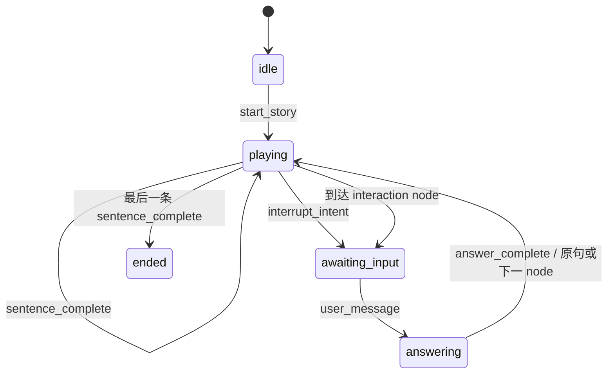

# Architecture

## 核心边界

StoryPal 把内容播放、AI 能力和客户端拆成三个边界：

- `StorySession` 是唯一的流程真相来源，维护 node、sentence、状态和互动记录；
- `CompanionProvider` 把业务需要的“根据上下文回答”与具体模型 SDK 解耦；
- Web 与微信小程序只负责呈现、输入和报告播放完成，不自行推进故事游标。

## 状态机

主动打断时不移动游标。`answer_complete` 先发出 `story_resumed`，随后再次发送当前 `story_sentence`。引导互动结束后进入下一个 node。

## 生产化接口

真实系统可以在 provider 层加入：

1. Streaming ASR：音频帧转换为孩子的文本；
2. Guardrailed LLM：结合当前句、故事摘要和年龄段生成回答；
3. Streaming TTS：将故事句子与回答转换为可中断音频；
4. Content safety：输入输出审核、降级回答和人工配置规则。

这些 adapter 未进入公开仓库，避免暴露供应商凭证和未验证的线上安全假设。
