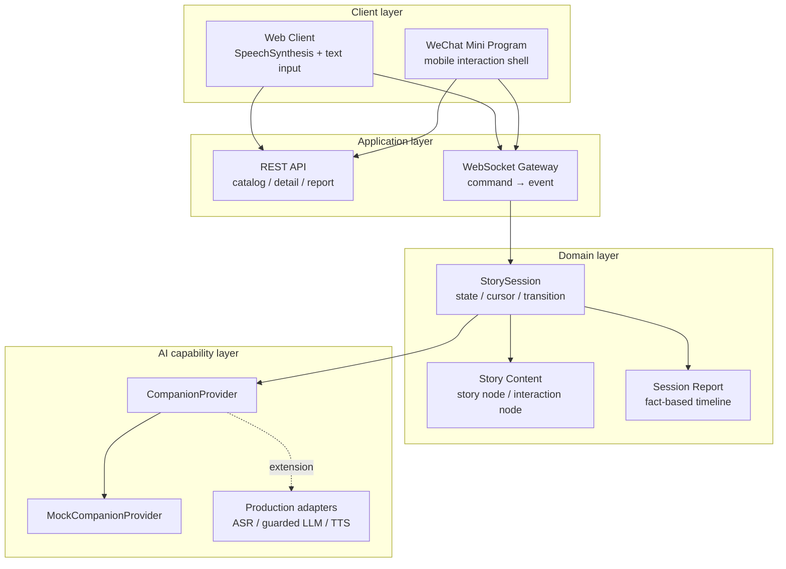
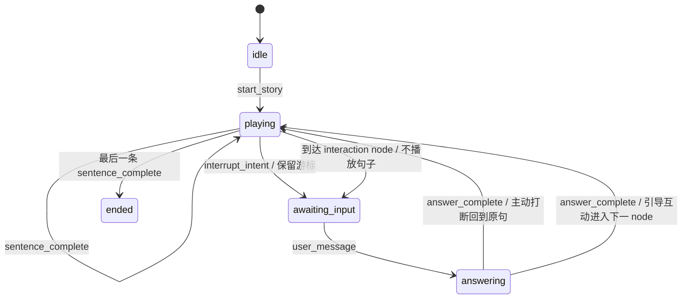
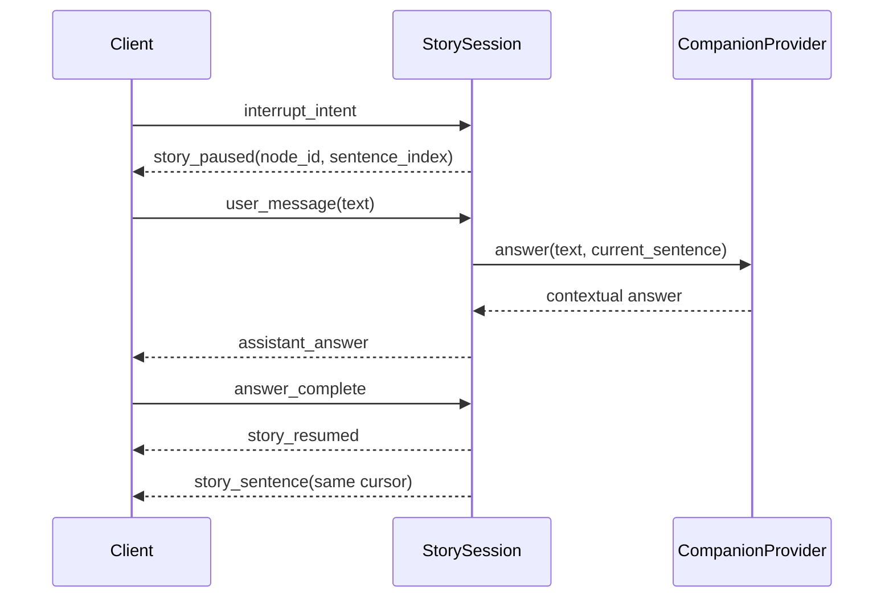

# System architecture

## 1. 设计目标

系统架构服务于四个产品要求：

1. 任意故事句播放时可以打断；
2. 回答后必须准确回到被打断的位置；
3. Web 与微信小程序的流程表现一致；
4. 更换 ASR、LLM、TTS 供应商时不重写产品状态机。

## 2. 模块视图



| 模块 | 当前职责 | 有意不承担的职责 |
| --- | --- | --- |
| Web / Mini Program | 呈现、收集输入、报告播放完成 | 决定下一个 node、保存权威游标 |
| FastAPI REST | 故事目录、故事详情、会话报告 | 故事状态推进 |
| WebSocket Gateway | 接收 command、返回 event、隔离连接 | 供应商业务逻辑 |
| `StorySession` | 状态、游标、转移规则、互动事实 | UI 表现、模型 SDK 调用细节 |
| Story JSON | 内容顺序、句子、引导问题 | 客户端布局 |
| `CompanionProvider` | 产品所需的语境回答 contract | 指定模型品牌与协议 |
| Report | 进度、互动数量和时间线 | 心理、智力或教育诊断 |

## 3. 单一状态来源

`StorySession` 是故事进度的唯一真相来源。客户端不发送“下一句是什么”，只发送事实或意图：

- `sentence_complete`：当前句已经播放完；
- `interrupt_intent`：用户希望暂停并表达；
- `user_message`：已经获得用户文本；
- `answer_complete`：AI 回答已经播放完。

因此，即使两个客户端的朗读实现不同，推进规则仍然一致。续播位置由 backend 保存的 `node_index + sentence_index` 决定，避免客户端计时器、网络延迟或重渲染造成游标漂移。

## 4. 状态机



### 转移约束

| 当前状态 | 合法 command | 结果 |
| --- | --- | --- |
| `idle` | `start_story` | 建立 session，进入 `playing` |
| `playing` + story node | `sentence_complete` | 下一句、下一 node 或结束 |
| `playing` + story node | `interrupt_intent` | 游标不移动，进入 `awaiting_input` |
| `awaiting_input` | `user_message` | 调用 provider，进入 `answering` |
| `answering` + 主动打断 | `answer_complete` | 发送 `story_resumed`，重发原句 |
| `answering` + 引导互动 | `answer_complete` | 推进到下一 node |

其他顺序会抛出 `StoryStateError` 并转成 `error` event。这个约束避免重复完成、回答期间再次打断和未开始就推进等问题。

## 5. 两条互动路径



主动打断把当前句作为上下文，回答后重发同一句。预设引导由 `interaction node` 触发，回答结束后进入下一个 node。两条路径共用 provider 和报告结构，但恢复规则不同。

## 6. 内容模型

故事使用结构化 JSON，当前有两类 node：

```json
{"id":"forest-night","type":"story","sentences":["第一句","第二句"]}
```

```json
{"id":"first-thought","type":"interaction","prompt":"如果你是主角，你会先问什么？"}
```

按句切分的价值包括：可定位打断点、可计算进度、可控制 TTS 粒度，并能把内容编辑与客户端代码分离。当前公开版是线性 node 列表；分支叙事、版本控制和内容 CMS 属于后续扩展。

## 7. Provider contract

产品状态机只依赖：

```python
async def answer(child_text: str, story_context: str) -> str: ...
```

公开版 `MockCompanionProvider` 输出确定性回答，用来验证产品流程、自动化测试和公开复现。真实 ASR 与 TTS 分别位于输入/输出链路，不应塞进 domain state machine；真实 LLM adapter 则实现上述 contract，并在外围加入年龄约束、内容安全、超时和降级策略。

## 8. 数据与安全边界

- Backend 默认监听 `127.0.0.1`；
- 公开版不收集录音；
- session 与 report 只存在于当前进程内；
- 报告记录 `kind / node_id / child_text / assistant_text / created_at`；
- 真实 AppID、private config、供应商密钥和第三方素材均不入库；
- 报告不输出儿童能力标签。

## 9. 生产化演进

| 领域 | 当前公开版 | 生产化需要 |
| --- | --- | --- |
| ASR | 文字输入模拟 | Streaming ASR、端点检测、低置信度追问 |
| LLM | 确定性 Mock | Guardrailed LLM、内容审核、超时降级 |
| TTS | Browser API / 定时器 | 可中断 Streaming TTS、音频缓存 |
| Session | 进程内字典 | 用户隔离、持久化、过期和删除策略 |
| Security | 本机监听 | Auth、WSS、限流、审计、监护人同意 |
| Operations | 手工启动 | 可观测性、错误告警、灰度和回滚 |

这些能力是架构预留，不属于当前公开版已实现范围。
