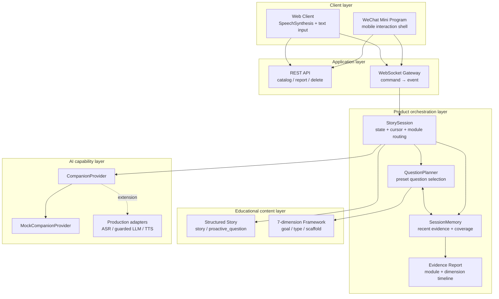
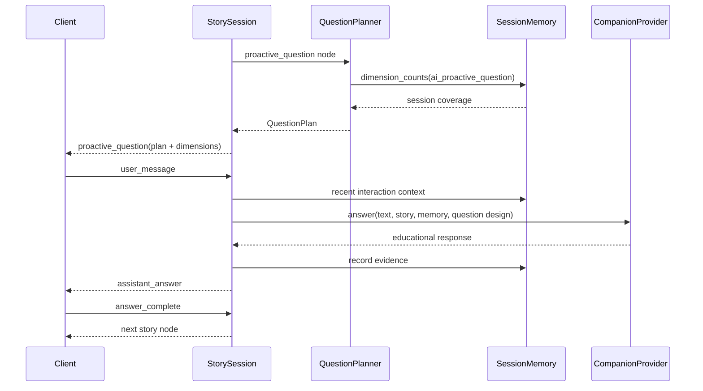
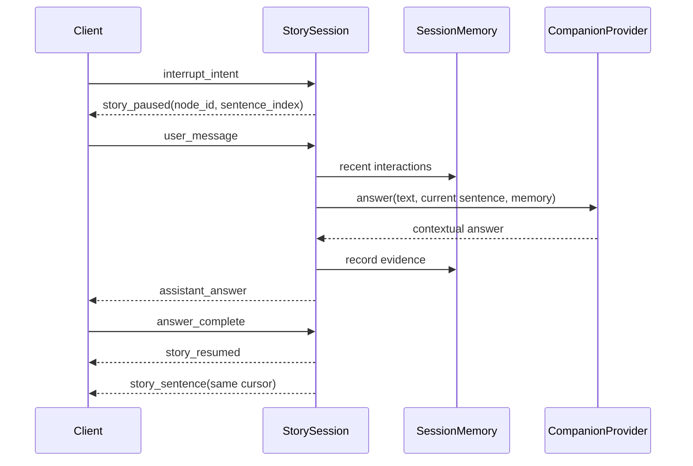
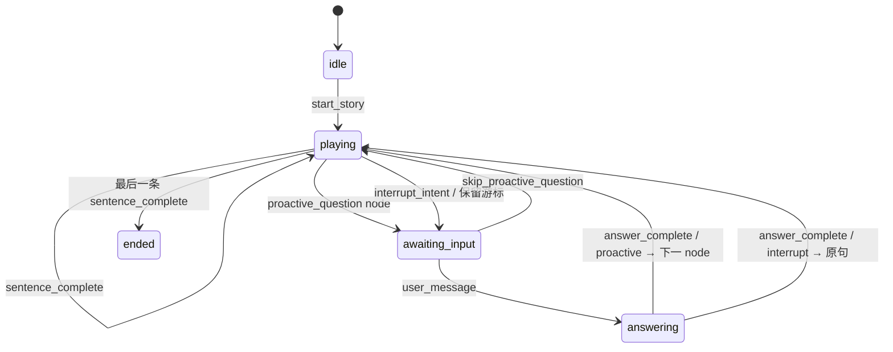
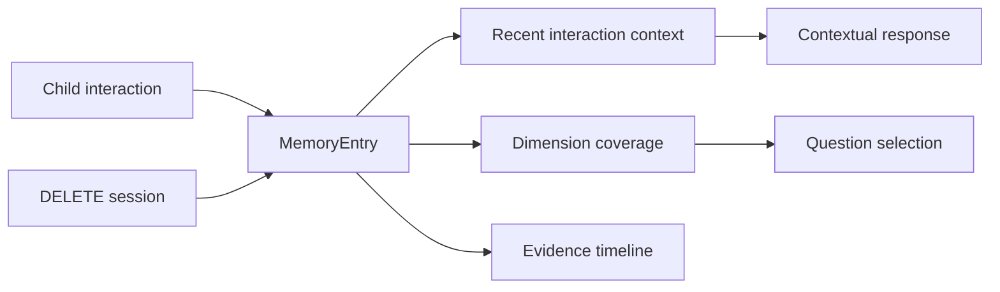

# System architecture

## 1. 架构目标

系统架构服务于六个产品要求：

1. AI 能在经过内容设计的剧情节点主动提问；
2. 孩子能在任意故事句播放时自主打断；
3. 回答后准确恢复到对应故事位置；
4. 主动问题能结合本次互动记忆减少维度重复；
5. Web 与微信小程序遵循同一套产品规则；
6. 更换 ASR、LLM、TTS 供应商时不重写教育内容和状态机。

## 2. 模块视图



| 模块 | 当前职责 | 有意不承担的职责 |
| --- | --- | --- |
| Web / Mini Program | 呈现、输入、播放完成、略过 | 决定权威游标或教育策略 |
| FastAPI REST | 故事目录、报告读取、会话删除 | 故事状态推进 |
| WebSocket Gateway | command/event 转换与连接隔离 | 供应商业务逻辑 |
| `StorySession` | 状态、游标、双模块路由、恢复规则 | UI 表现和模型 SDK 细节 |
| `QuestionPlanner` | 从预设候选中选择本轮主动问题 | 临场自由生成教育问题 |
| `SessionMemory` | 本次会话事实、近期互动、维度覆盖 | 诊断标签和长期儿童画像 |
| Story JSON | 叙事、问题池、目标、触发、脚手架 | 客户端布局 |
| `CompanionProvider` | 根据当前故事与记忆上下文回应 | 控制故事游标 |
| Evidence Report | 双模块次数、维度证据、时间线 | 能力或心理评分 |

## 3. 双交互引擎

### AI 预设主动提问



主动问题只从内容编辑者设计的候选池中选择。Planner 使用本次会话的维度覆盖做低风险个性化，不允许模型脱离故事临场制造教学目标。

每个候选问题包含：

```text
question_id
prompt
primary_dimension
dimensions
question_type
learning_goal
scaffold_prompt
trigger_reason
follow_up_policy
```

### 用户打断提问



打断模块从孩子真实问题推断本轮响应维度。它不改变主动问题池，也不推进当前游标；回答完成后重播原句。

| 规则 | AI 主动提问 | 用户打断提问 |
| --- | --- | --- |
| 发起者 | 系统 | 孩子 |
| 触发条件 | 到达 `proactive_question node` | `playing + story node` |
| 教育维度 | 内容设计时预设，Planner 选择 | 根据孩子本次表达分类 |
| 上下文 | 问题目标、当前情节、会话记忆 | 当前句、近期互动记忆 |
| 可否略过 | 可以 | 不适用 |
| 回答后 | 下一 node | 回到被打断原句 |

## 4. 单一状态来源

`StorySession` 是故事进度的唯一真相来源。客户端只报告事实或意图：

- `sentence_complete`：当前故事句播放完；
- `interrupt_intent`：孩子希望暂停并表达；
- `user_message`：已经得到儿童输入文本；
- `skip_proactive_question`：略过系统主动问题；
- `answer_complete`：AI 回答播放完。

续播位置由 backend 保存的 `node_index + sentence_index` 决定，避免不同客户端计时器、网络延迟和重渲染造成游标漂移。

## 5. 状态机



| 当前状态 | 合法 command | 结果 |
| --- | --- | --- |
| `idle` | `start_story` | 创建 session 与 session memory |
| `playing` + story | `sentence_complete` | 下一句、下一 node 或结束 |
| `playing` + story | `interrupt_intent` | 游标不变，进入用户打断模块 |
| `awaiting_input` + proactive | `skip_proactive_question` | 记录略过事实并进入下一 node |
| `awaiting_input` | `user_message` | 调用 Provider，写入记忆 |
| `answering` + proactive | `answer_complete` | 推进下一 node |
| `answering` + interrupt | `answer_complete` | `story_resumed` 后重发原句 |

非法顺序转成 `error` event，避免重复完成、回答期间再次打断和未开始就推进。

## 6. Memory Layer



### 当前公开版实现

`SessionMemory` 只存在于 Python 进程内，每条 `MemoryEntry` 包含：

- `interaction_module`：主动提问或打断提问；
- `node_id` 与当前情节摘要；
- 儿童原始表达和 AI 回答；
- 教育维度与输入分类；
- 回答/略过状态和时间。

它支持三种读取方式：

1. Provider 获取最近三条互动，保持对话连续；
2. Question Planner 获取主动问题维度覆盖，减少重复；
3. Report 获取双模块次数、维度证据和完整时间线。

### 儿童记忆分层

| 层级 | 当前公开版 | 生产化边界 |
| --- | --- | --- |
| 故事工作记忆 | 当前 node、sentence、情节上下文 | 可加入实体与事件图谱 |
| 单次会话记忆 | 已实现，进程内保存 | 可增加 TTL 与幂等写入 |
| 教育策略记忆 | 本次维度覆盖 | 长期使用需证据阈值和人工评审 |
| 跨会话儿童记忆 | 未实现 | 必须有监护人同意、查看、删除和关闭 |

公开版没有 `ability_score`。维度计数只表示“本次出现过多少条互动证据”，不能代表儿童稳定能力。

## 7. 教育内容模型

故事有两类 node：

```json
{"id":"forest-night","type":"story","sentences":["第一句","第二句"]}
```

```json
{
  "id": "first-thought",
  "type": "proactive_question",
  "question_design": {
    "trigger_reason": "剧情自然停顿处",
    "selection_policy": "least_exposed_dimension_in_session",
    "candidates": [
      {
        "question_id": "emotion-question",
        "prompt": "小星星现在可能是什么心情？为什么？",
        "primary_dimension": "emotional_understanding",
        "dimensions": ["emotional_understanding", "logic"],
        "question_type": "emotion_and_reason",
        "learning_goal": "识别角色情绪，并用故事线索说明原因。",
        "scaffold_prompt": "可以从害怕或着急里选一个。"
      }
    ]
  }
}
```

按句切分支持打断定位、进度计算和 TTS 控制。主动问题独立成 node，避免把提问写进故事正文，也让内容团队可以单独审阅问题时机和教育目标。

## 8. Provider contract

状态机依赖的产品级 contract：

```python
async def answer(
    child_text: str,
    story_context: str,
    interaction_context: dict | None = None,
) -> str: ...
```

`interaction_context` 包含模块类型、输入分类、维度、脚手架和近期互动记忆。公开版 `MockCompanionProvider` 输出确定性回答；真实 adapter 应在外围加入年龄约束、输入输出审核、超时和降级。

## 9. 数据与安全边界

- Backend 默认监听 `127.0.0.1`；
- 公开版不接收或保存录音；
- Memory 和 Report 只存在于当前进程；
- `DELETE /api/sessions/{session_id}` 支持立即删除；
- 不写入姓名、联系方式、账号或真实儿童身份；
- 真实 AppID、供应商密钥和第三方素材不入库；
- 报告不输出儿童能力或心理标签。

## 10. 生产化演进

| 领域 | 当前公开版 | 生产化需要 |
| --- | --- | --- |
| Question Planner | 会话维度最少覆盖策略 | 年龄、兴趣、难度、频率与内容审核 |
| Memory | session-only、进程内 | 监护人同意、TTL、导出、删除、审计 |
| ASR | 文字输入模拟 | Streaming ASR、端点检测、低置信度澄清 |
| LLM | 确定性 Mock | Guardrailed LLM、事实包、审核、超时降级 |
| TTS | Browser API / 定时器 | 可中断 Streaming TTS、音频缓存 |
| Security | 本机监听 | Auth、WSS、限流、租户隔离 |
| Operations | 手工启动 | 可观测性、错误告警、灰度和回滚 |

这些生产能力是架构演进方向，不属于当前公开版已实现范围。
