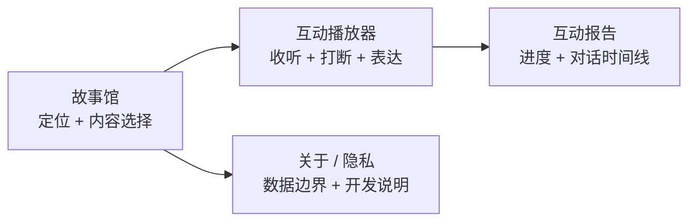

# Product design

## 1. 设计原则

StoryPal 的交互设计遵循五个原则：

1. **当前状态可见**：准备、连接、讲述、暂停、轮到表达、AI 回答、恢复和完成都有明确文案；
2. **主操作单一**：每个状态只突出一个主要动作，降低儿童界面的选择负担；
3. **内容优先**：播放页把故事句作为视觉中心，系统提示保持短小；
4. **恢复有预告**：AI 回答后先提示“回到刚才那一句”，再继续播放；
5. **报告克制**：呈现事实，不制造能力标签和伪精确评分。

## 2. 信息架构

### Web

- 首页：产品价值、原创故事入口、核心闭环说明；
- 播放器：连接状态、进度、当前内容、输入与打断控制；
- 报告：完成进度、互动次数、数据模式、对话时间线和边界说明。

### 微信小程序

- 故事馆：移动端故事卡片和连接失败降级；
- 播放器：单手可触达的打断按钮、文字输入和状态反馈；
- 报告：会话事实与互动时间线；
- 关于：隐私边界、AppID 配置和本地调试说明。

## 3. 端到端体验地图

| 阶段 | 用户目标 | 界面反馈 | 系统行为 |
| --- | --- | --- | --- |
| 进入故事馆 | 判断内容是否适合 | 标题、摘要、年龄、原创标识 | 拉取 catalog；失败时小程序显示内置目录 |
| 进入播放器 | 知道是否可以开始 | `连接中 → 本地演示已连接` | 建立 WebSocket |
| 开始故事 | 进入收听状态 | 隐藏开始按钮，显示故事句和进度 | 创建 session，发送第一句 |
| 听故事 | 关注内容 | 大字号正文、低干扰状态、打断按钮可用 | 等待播放完成或打断意图 |
| 主动打断 | 立即表达 | 停止朗读、显示“故事已暂停”、自动聚焦输入 | 保留游标，进入倾听态 |
| 引导互动 | 回答故事问题 | 显示“轮到你表达”，禁用打断 | 使用 interaction node 的 prompt |
| AI 回答 | 理解回应 | 隐藏输入，显示并朗读回答 | provider 生成回答并记录互动 |
| 回到故事 | 找回上下文 | “我们回到刚才那一句” | 主动打断重播原句；引导互动进入下一 node |
| 完成 | 回顾本次体验 | 100% 进度、完成文案、报告入口 | 保存当前进程内报告 |

## 4. 播放器状态设计

播放器是产品设计的核心，不同状态下的内容和操作如下：

| 状态 | 主文案 | 输入框 | 打断按钮 | 自动行为 |
| --- | --- | --- | --- | --- |
| 准备 | 点击“开始”进入故事 | 隐藏 | 禁用 | 等待连接与开始 |
| 讲述 | 当前故事句 | 隐藏 | 启用 | 朗读结束发送 `sentence_complete` |
| 主动暂停 | 故事暂停了，我在听 | 显示并聚焦 | 禁用 | 等待用户输入 |
| 引导表达 | 预设问题 | 显示 | 禁用 | 等待用户输入 |
| AI 回答 | provider 回答 | 隐藏 | 禁用 | 朗读结束发送 `answer_complete` |
| 恢复 | 我们回到刚才那一句 | 隐藏 | 随原句再次启用 | 重播原句 |
| 完成 | 互动报告已经生成 | 隐藏 | 禁用 | 开放报告入口 |
| 错误 | 可解释错误信息 | 依据前态 | 禁用 | 不静默推进 |

打断按钮采用高对比珊瑚色和手掌符号，在故事播放时成为唯一显著的即时操作。非讲述状态禁用打断，避免孩子在 AI 回答或输入阶段叠加新请求。

## 5. 为什么按“句”设计播放单元

句子是内容理解、技术实现和恢复体验之间的折中：

- 比整段更容易定位打断点和计算进度；
- 比单词时间戳更稳定，能跨不同 TTS provider；
- 重播一句通常足以恢复语境，又不会大幅倒退；
- 内容编辑者能直接控制停顿和引导节点位置。

公开版在句子播放完成后由客户端发送事件，backend 不猜测播放时长。Web 使用语音合成回调，小程序公开版使用 2.6 秒定时器模拟；后者是演示限制，生产版应使用真实音频结束事件。

## 6. 主动打断交互细节

### 触发前

- 仅当前 event 为 `story_sentence` 时启用；
- 保持按钮位置固定，减少寻找成本；
- 进度条继续显示被打断句所在位置。

### 触发时

- 立即取消当前浏览器朗读或小程序计时器；
- 把按钮禁用，避免重复触发；
- 状态文案切换为“故事已暂停”；
- Web 自动聚焦文字输入框。

### 回答后

- 输入区隐藏，防止回答播放时继续提交；
- 先显示恢复提示，再重发被打断句；
- 重播后重新启用打断，使体验回到标准讲述状态。

真实语音版需要增加录音权限说明、按住说/自动端点选择、识别中状态、转写确认和取消入口。公开版没有伪装这些能力，明确用文字模拟 ASR。

## 7. 引导问题设计

引导问题属于内容编排，适合放在事件发生后、答案尚未揭晓或角色需要做决策的位置。示例故事使用：

- “如果你是米粒，你会先问小星星什么？”——换位与问题生成；
- “米粒为什么要请不同的朋友一起帮忙？”——因果理解与合作主题。

问题文案遵循：一次只问一件事、不要求标准答案、能用短句回答、与刚发生的情节直接相关。公开版 Mock 会承接孩子表达并邀请继续思考，不给出评分。

## 8. 报告设计

报告页采用“结果摘要 + 对话时间线 + 报告边界”结构：

1. **结果摘要**：完成进度、互动次数、数据模式；
2. **时间线**：区分主动打断和引导互动，保留双方原始文本；
3. **边界说明**：明确不做心理、智力或教育诊断。

没有加入“专注力 92 分”“创造力优秀”等指标，因为当前数据无法支持这类推断。生产验证若需要长期洞察，也应从可观察行为开始，并允许家长查看、纠正和删除原始记录。

报告使用 HTML 转义处理用户输入，避免对话文本被当作页面代码执行。

## 9. 视觉系统

| 元素 | 使用方式 | 设计意图 |
| --- | --- | --- |
| Forest green | 品牌色、主按钮、连接成功 | 安静、自然，适合长时间内容体验 |
| Coral | 打断按钮、关键进度 | 强调当前可操作点 |
| Warm paper | 页面背景 | 降低纯白屏的视觉刺激 |
| Mint | 标签和辅助区 | 表达轻量状态，不与主操作竞争 |
| Serif story text | 播放器正文 | 区分故事内容和系统 UI |
| Rounded cards | 故事卡、播放器、报告 | 形成稳定、友好的内容容器 |

首页插画使用 CSS 渐变和 emoji 组合，不依赖版权来源不明的封面。微信小程序延续同一配色和圆角语汇，但保留原生页面与 tabBar 结构。

## 10. 跨端一致与差异

保持一致：故事数据、状态名、command/event、打断规则、恢复规则、报告口径。

允许差异：

- Web 适合桌面演示，首页承担更多产品解释；
- 小程序以移动端触达为主，tabBar 增加独立隐私入口；
- Web 可直接调用 `SpeechSynthesis`，小程序公开版只模拟播放完成；
- 小程序服务断开时保留内置故事目录，Web 更明确地呈现连接状态。

这种设计把“产品逻辑一致”和“平台交互自然”分开处理。

## 11. 无障碍与儿童友好细节

当前已实现或体现：

- 移动端响应式布局和大字号故事文本；
- 主要按钮有文字或可理解符号；
- 连接和播放状态不只依赖颜色，也有文字；
- 输入长度限制为 120 字符，减少异常长输入；
- 异常不自动跳过内容；
- 原创故事避免依赖复杂背景知识。

仍需完善：键盘焦点样式、屏幕阅读器 live region、减少动态效果选项、真实儿童可用性测试、多方言 ASR 和低识字用户的语音确认。

## 12. 设计验证清单

公开版已验证：

- Web 首页和播放器在真实浏览器中可见；
- 故事目录、健康检查 API 和 WebSocket 可连接；
- 主动打断后回到相同 node 和 sentence；
- 引导互动能推进到下一 node；
- 非法顺序会抛出明确错误；
- 报告能区分互动来源并转义用户输入；
- Web 与微信小程序源码消费同一协议。

尚未完成：真实儿童测试、微信开发者工具真机验证、真实 ASR/LLM/TTS 的延迟与安全评估、长期使用指标验证。
