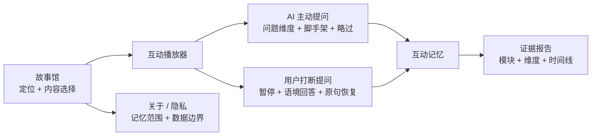

# Product design

## 1. 产品设计原则

1. **教育目标进入内容结构**：问题的维度、时机和脚手架在故事设计阶段明确，不依赖模型临场发挥；
2. **儿童保有主动权**：AI 可以主动引导，儿童也可以随时打断或略过；
3. **当前状态可见**：讲述、主动提问、用户打断、AI 回答、恢复和完成有不同反馈；
4. **一次只做一件事**：每个状态突出一个主要动作，降低儿童界面的选择负担；
5. **记忆服务连续性**：Memory 用于保持上下文和减少重复，不用于给儿童贴标签；
6. **内容优先**：故事句是播放器视觉中心，系统提示保持短小；
7. **报告克制**：展示互动证据，不制造能力和心理评分。

## 2. 教育价值链

StoryPal 把儿童故事从单向内容消费转成有设计目标的互动学习过程：

```text
听懂情节 → 注意线索 → 解释原因 → 理解角色 → 形成想法 → 组织表达 → 回到故事验证
```

系统不要求每次互动同时覆盖全部目标。每个问题选择一个主要维度和少量自然关联维度，通过故事中的具体线索支持儿童完成一个可观察动作，例如：

- 指出一个细节并说明理由；
- 用“因为……所以……”整理因果；
- 识别角色情绪并联系情节；
- 预测下一步并解释依据；
- 提出另一种可能性；
- 用完整句复述或表达观点。

产品保留三个教育边界：允许多个合理答案，允许儿童说“不知道”，允许略过并继续故事。一次互动只形成过程证据，不形成能力诊断。

### 教育设计闭环

| 阶段 | 产品机制 | 教育价值 |
| --- | --- | --- |
| 内容设计 | 七维问题卡、自然停顿点、年龄适配 | 教育目标在生成前可审核 |
| AI 主动提问 | Planner 选择维度覆盖较少的候选 | 确保安静儿童也获得思考机会 |
| 用户打断 | 保留真实问题和当前故事语境 | 保护好奇心与自主表达 |
| 回应 | 故事证据、适龄语言、一个脚手架 | 帮助儿童继续思考，而非代替回答 |
| 续播 | 回到准确故事句 | 减少情境切换和工作记忆负担 |
| Memory | 记录模块、原话、维度和情节 | 保持连续并减少机械重复 |
| 报告 | 展示过程证据和覆盖范围 | 家长能理解发生了什么，不被伪分数误导 |

低延迟在这个闭环中的价值是缩短“产生问题—获得回应—回到情节”的断裂时间。流式工程服务学习节奏，不单独构成教育价值。

## 3. 产品信息架构



### Web

- 首页：儿童 AI 教育内容定位、双交互引擎、Memory Layer；
- 播放器：连接、进度、故事句、主动问题、打断和略过；
- 报告：双模块次数、维度证据、互动记忆时间线和隐私边界。

### 微信小程序

- 故事馆：移动端故事卡片和连接失败降级；
- 播放器：单手可触达的打断入口、主动问题与略过；
- 报告：模块次数、维度覆盖和对话事实；
- 关于：双交互说明、Memory 边界和开发配置。

## 4. 双交互体验地图

| 阶段 | 用户目标 | 界面反馈 | 系统行为 |
| --- | --- | --- | --- |
| 进入故事馆 | 判断内容是否适合 | 标题、摘要、年龄和原创标识 | 拉取 catalog；小程序失败时显示内置目录 |
| 进入播放器 | 知道是否可以开始 | `连接中 → 本地演示已连接` | 建立 WebSocket |
| 开始故事 | 进入收听状态 | 显示故事句、进度和打断按钮 | 建立 session 与 Memory |
| 听故事 | 关注情节 | 大字号正文，提示“可以随时打断” | 等待播放完成或打断意图 |
| 用户打断 | 立即表达真实问题 | 停止朗读，显示“用户打断提问” | 保留游标并读取近期记忆 |
| AI 主动提问 | 回应与情节相关的教育问题 | 显示维度、问题和学习目标 | Planner 从预设池选择问题 |
| 不知道 | 获得更低门槛提示 | 展示脚手架式回应 | 使用 `scaffold_prompt` |
| 不想回答 | 保持自主权 | “稍后再说” | 记录略过并进入下一 node |
| AI 回答 | 理解系统回应 | 标注“主动提问回应”或“打断问题回应” | 写入 MemoryEntry |
| 回到故事 | 找回上下文 | “我们回到刚才那一句” | 打断模块重播原句 |
| 完成 | 回顾体验 | 100% 进度与报告入口 | 生成双模块和维度证据报告 |

## 5. 七维问题设计

### 大语文

设计对象：词语、修辞、顺序表达、人物语言、文学主题。

问题形式：

- “你能用‘先、然后、最后’说说发生了什么吗？”
- “这句话为什么让你觉得画面很安静？”
- “如果换一个词，角色的心情会不会不一样？”

设计细节：避免考术语；先从故事中的具体词句出发，再帮助儿童组织表达。

### 百科知识

设计对象：动物、自然、科学、生活常识和可验证事实。

问题形式：

- “故事里哪些线索让你觉得它是一种鲸？”
- “你还想观察这个动物的什么地方？”

设计细节：问题必须有可靠事实边界；回答给一到两个具体知识点，无把握的数字、地点和年份不编造。

### 文化理解

设计对象：神话、历史、传统文化、地域生活、人物典故。

问题形式：

- “这个人物为什么会做出这样的选择？”
- “古代没有手机，人们可能怎样传递消息？”

设计细节：补充真实背景，避免把现代价值和概念机械套入历史语境。

### 逻辑思维

设计对象：原因、证据、顺序、比较、选择、结果。

问题形式：

- “米粒为什么要请不同的朋友一起帮忙？”
- “你听到了哪些线索？”
- “如果少了其中一步，结果可能怎样？”

设计细节：鼓励儿童说出过程；回应指出具体线索并帮助整理，不只判断正确或错误。

### 情绪理解

设计对象：情绪识别、原因、角色视角、共情和应对。

问题形式：

- “小星星一个人在陌生森林里可能是什么心情？为什么？”
- “如果认真做的东西没人看懂，你可能会有什么感觉？”

设计细节：允许多种合理感受；情绪必须连接具体情节；不从回答推断儿童心理状态。

### 想象力

设计对象：情节预测、反事实、角色替换、画面化创造。

问题形式：

- “如果你是米粒，你会先问小星星什么？”
- “如果地图被风吹走了，你还能想到什么办法？”

设计细节：先保护脑洞，再说明故事或现实边界；开放问题不设唯一标准答案。

### 语言表达

设计对象：描述、复述、理由表达、完整句组织。

问题形式：

- “你能把刚才的想法说得更完整一点吗？”
- “可以用‘因为……所以……’说说你的理由吗？”

设计细节：脚手架帮助儿童启动表达，但不能替儿童直接完成答案。

## 6. 主动问题的设计卡

内容编辑者设计一个问题时，需要完成以下卡片：

| 项目 | 设计问题 |
| --- | --- |
| 情节触发 | 为什么在这里暂停最自然？ |
| 主维度 | 本轮主要支持哪一种思考或表达？ |
| 副维度 | 是否自然带出另一维度？ |
| 问题类型 | 情绪、因果、预测、复述、知识还是开放创造？ |
| 学习目标 | 儿童完成什么可观察动作？ |
| 年龄适配 | 是否需要术语、背景知识或过长工作记忆？ |
| 开放程度 | 是否允许多个合理答案？ |
| 脚手架 | 儿童说“不知道”时如何降低难度？ |
| 追问策略 | 最多追问几次，何时回到故事？ |
| 略过 | 略过后是否影响理解故事？ |
| 安全边界 | 是否触及恐惧、羞耻、家庭或其他敏感主题？ |

公开版把这些内容放进 `question_design`，招聘方可以从故事 JSON 直接看到产品设计如何落到数据结构。

## 7. Question Planner 交互

Planner 不自由创作问题，只在经过审核的候选中选择：

```text
候选 A：想象力 × 语言表达
候选 B：情绪理解 × 逻辑
+ 本次主动问题维度覆盖
→ 选择覆盖较少的候选
```

界面显示：

- “AI 主动提问”；
- 本轮教育维度；
- 面向孩子的问题；
- 简短学习目标；
- 回答与“稍后再说”。

`selection_reason` 进入协议和调试数据，帮助产品与内容团队理解系统为什么选中该问题。

## 8. 用户打断交互

### 触发前

- 仅当前 event 为 `story_sentence` 时启用；
- 打断按钮固定在播放器主要操作区；
- 状态文字明确提示“可以随时打断”。

### 触发时

- 立即取消当前朗读或播放计时；
- 保留 `node_id + sentence_index`；
- 禁用重复打断；
- 显示“用户打断提问 · 故事已暂停”；
- Web 自动聚焦输入框。

### 回答时

- 读取当前故事句和最近三条互动记忆；
- 从儿童输入识别知识、情绪、想象、逻辑或表达方向；
- 回答区标明“打断问题回应”；
- 写入模块、维度和对话事实。

### 回答后

- 先显示恢复提示；
- 重发被打断原句；
- 原句开始后重新开放打断。

完整原型已经实现录音状态、Streaming ASR 和结束信号；公开版明确使用文字模拟 ASR。产品化仍需补齐更完整的录音权限说明、低置信度转写确认、取消入口和儿童语音隐私治理。

## 9. “不知道”和略过

“不知道”不等于失败。主动问题候选提供 `scaffold_prompt`，把任务缩小成选择、观察一个细节或完成半句话。

示例：

```text
原问题：小星星可能是什么心情？为什么？
脚手架：它可能有点害怕，也可能很着急。你觉得哪一种更像？
```

如果儿童不想回答，可以选择“稍后再说”。系统记录 `status=skipped`，不生成负面评价，也不阻断故事。

## 10. Memory Layer 的产品设计

### 被记住的内容

- 这是 AI 主动问题还是用户打断问题；
- 发生在哪个故事节点；
- 儿童实际说了什么；
- 系统实际回应了什么；
- 涉及哪些教育维度；
- 是回答还是略过。

### 不被记住的内容

- 真实姓名、联系方式和账号；
- “聪明”“内向”“逻辑差”等人物标签；
- 未经监护人同意的跨会话画像；
- 由一次回答推断出的心理状态；
- 公开版中的录音。

### 记忆可见性

报告把 Memory 呈现为时间线，家长能看到事实来源。公开版还提供立即删除接口。生产版需要进一步提供监护人同意、查看、纠正、导出、关闭和自动过期。

## 11. 播放器状态矩阵

| 状态 | 主文案 | 输入 | 打断 | 略过 | 自动行为 |
| --- | --- | --- | --- | --- | --- |
| 准备 | 点击开始进入故事 | 隐藏 | 禁用 | 隐藏 | 等待连接 |
| 讲述 | 当前故事句 | 隐藏 | 启用 | 隐藏 | 播放完推进 |
| AI 主动提问 | 问题＋维度 | 显示 | 禁用 | 显示 | 等待回答 |
| 用户打断 | 故事已暂停 | 显示并聚焦 | 禁用 | 隐藏 | 等待问题 |
| AI 回答 | 模块类型＋回答 | 隐藏 | 禁用 | 隐藏 | 播放完按模块恢复 |
| 恢复 | 回到刚才那一句 | 隐藏 | 随原句启用 | 隐藏 | 重播原句 |
| 完成 | 报告已生成 | 隐藏 | 禁用 | 隐藏 | 开放报告 |
| 错误 | 可解释错误 | 依据前态 | 禁用 | 隐藏 | 不静默推进 |

## 12. 报告设计

报告结构：

1. **双模块摘要**：完成进度、AI 主动提问次数、用户打断次数；
2. **教育维度覆盖**：每个维度对应多少条本次互动证据；
3. **Memory 时间线**：模块、维度、儿童原话、AI 回应和略过状态；
4. **边界说明**：session-only、可删除、不提供诊断。

没有加入“逻辑能力 92 分”“情商优秀”等指标。证据数量也不能排序儿童能力，只用于说明本次内容和互动覆盖了什么。

报告页对用户文本进行 HTML 转义，避免互动内容被当成页面代码执行。

## 13. 视觉系统

| 元素 | 使用方式 | 设计意图 |
| --- | --- | --- |
| Forest green | 品牌色、主按钮、连接成功 | 安静、自然，适合内容体验 |
| Coral | 打断按钮、关键进度 | 强调儿童当前可操作点 |
| Warm paper | 页面背景 | 降低纯白屏视觉刺激 |
| Mint | 维度标签和辅助区 | 表达教育信息但不抢内容 |
| Serif story text | 播放器正文 | 区分故事内容与系统 UI |
| Rounded cards | 故事、播放器、报告 | 形成稳定友好的容器 |

首页视觉使用 CSS 渐变和 emoji，不依赖版权来源不明的封面。

## 14. 跨端一致与差异

保持一致：故事数据、双模块名称、Question Plan、Memory 字段、command/event、恢复规则和报告口径。

允许差异：

- Web 首页承担更多产品解释，适合招聘方快速理解；
- 小程序突出单手操作和独立隐私入口；
- Web 使用 `SpeechSynthesis`，小程序公开版用定时器模拟播放完成；
- 小程序服务断开时保留内置目录，Web 直接显示连接状态。

## 15. 儿童友好与安全细节

当前已实现：

- 移动端响应式布局和大字号故事文本；
- 状态文字不只依赖颜色；
- 非讲述状态禁用打断；
- 主动问题允许略过；
- 输入限制 120 字符；
- “不知道”使用脚手架；
- 异常不自动跳过内容；
- Memory session-only 且支持删除；
- 报告只展示互动证据。

仍需验证：

- 真实儿童是否理解双模块状态；
- 主动问题频率是否影响沉浸；
- 脚手架是否真正降低表达门槛；
- 微信开发者工具与真机交互；
- 屏幕阅读器 live region、减少动态效果和多方言 ASR；
- 监护人对 Memory 说明和删除入口的理解。

## 16. 当前验证

公开版自动化测试覆盖：

- 主动问题完整流程；
- 用户打断后回到相同 node 和 sentence；
- Planner 根据 Memory 避免重复主动问题维度；
- Memory 保存最近互动但不包含能力分数；
- 主动问题略过；
- session 立即删除；
- 非法消息顺序拒绝；
- 完整故事和报告生成。

这些验证说明流程与数据结构可运行，不代表真实儿童效果或模型质量已经验证。

## 17. 低延迟回答的产品体验

完整原型已经实现真实语音的低延迟流式体验；当前公开仓库为了无密钥复现，显示完整 Mock 文本后使用本地语音播放。以下同时记录已实现交互和产品化边界。

### 把等待拆成可感知阶段

| 阶段 | 儿童看到/听到什么 | 产品目的 |
| --- | --- | --- |
| 点击打断 | 当前朗读立即停止，按钮切换为“我在听” | 已实现本地停播，不等待服务端 |
| 识别中 | 显示录音/识别状态，可结束输入 | Streaming ASR 与 `speech_end` 已实现 |
| 思考中 | LLM 文本增量到达 | 已实现 SSE token stream |
| 首句就绪 | SmartBuffer 把可播句立即送入 TTS | 已实现；分句阈值仍需调优 |
| 补充回答 | PCM chunk 边生成边播放 | 已实现并发 TTS、有序发送和 200ms jitter buffer |
| 回到故事 | 明确提示后重播被打断原句 | 已实现按实际起播 cursor 恢复 |

### 回答长度与结构

默认控制在 2–4 句：

1. 第一层直接回应儿童问题，不先复述长背景；
2. 第二层连接当前故事线索，帮助理解回答来源；
3. 第三层只在需要时给一个追问或脚手架；
4. 儿童继续追问时再展开知识，不一次塞入完整百科说明。

### 速度与效果的分流规则

- 主动问题来自审核池，可以预生成语音，优先保证稳定与即时；
- 简单故事问题采用短上下文和低延迟回答路径；
- 知识问题需要事实依据，无可靠事实时明确表示不确定；
- 情绪和敏感主题进入更严格审核，允许超过普通延迟目标；
- ASR 低置信度时先澄清，不让错误转写进入长回答；
- Provider 超时或断网时给简短说明，并允许继续故事或重试。

### 播放中的再次打断

完整原型在新一轮打断时立即停止本地 source、清空待播放音频，并通过 `turn_id`、`client_interaction_id` 和 discard window 降低旧音频迟到的影响。当前二进制 PCM 帧还没有携带 `response_id`，因此产品化版本需要把音频 generation 写入协议，并修复恢复阶段连续二次打断的状态覆盖。报告只应记录实际完成或明确取消的互动，避免把未播放内容当成儿童已经听到的证据。

### 工程取舍如何影响体验

- 200ms jitter buffer 会增加固定起播等待，但显著减少公网音频断续；
- 200ms 麦克风回溯缓冲用于保护开头音节，不应与播放 jitter buffer 混为同一指标；
- 三路 TTS 并发降低完整回答合成时间，sender queue 负责守住语句顺序；
- SmartBuffer 同时承担首段速度与语音完整性，字符阈值需要用真实回答分布调优；
- 预生成故事音频保证叙事音质，实时 TTS 只承担开放互动，避免让所有内容都支付实时生成成本；
- Memory preload 和回答后异步更新把个性化从关键延迟路径中移出。

### 联合评估

低延迟与回答效果需要共同判断：首段更快但频繁答非所问、事实错误或需要儿童重复，都不算体验提升。测试应同时记录操作反馈、首段音频、恢复成功率、故事事实一致性、适龄性、澄清率、安全降级率和儿童继续表达率。
