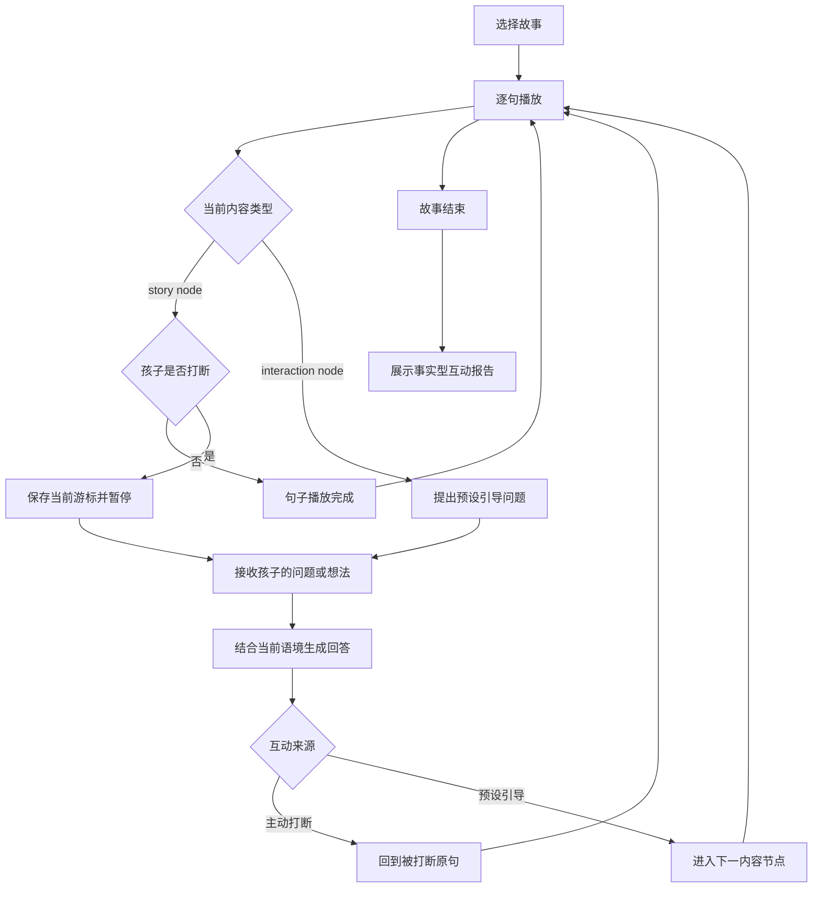

# Product logic

## 1. 产品命题

传统有声故事优化的是内容供给和播放效率，孩子在收听过程中的问题、联想和判断通常无法进入播放流程。StoryPal 的产品命题是：在不破坏故事连续性的前提下，把收听过程中的表达变成对话，再让对话自然回到故事。

目标用户和使用场景目前是产品假设，公开版没有把它写成已验证的用户研究结论：

- **直接使用者**：6–10 岁、能够理解故事并进行简单口头或文字表达的儿童；
- **购买与决策者**：希望孩子主动表达、同时关注内容和数据安全的家长；
- **典型场景**：家庭独立收听、亲子共读辅助、睡前之外的短时内容互动；
- **不覆盖场景**：教育测评、心理咨询、无人监护的开放式儿童聊天。

## 2. 核心用户任务

从孩子视角，任务不是“使用 AI”，而是：

> 听故事时有问题可以马上问，有想法可以马上说，问完以后还能知道故事讲到哪里。

从家长视角，任务是：

> 知道孩子在故事中表达过什么，同时不把一次对话包装成能力诊断。

这两个任务对应两条产品价值：即时表达和可解释记录。

## 3. 核心闭环



闭环成立需要同时满足三个条件：孩子知道现在能否表达、系统保留打断位置、回答完成后有确定的恢复规则。

## 4. 两类互动为什么要分开

### 主动打断 `interrupt`

孩子在故事句播放期间自主发起，适合即时问题和联想。系统保留当前游标，回答结束后重播原句。

产品价值：尊重真实兴趣，不要求孩子等到预设节点。

### 引导互动 `guided`

内容作者在故事结构中预设 `interaction node`，适合预测、换位思考和因果表达。回答结束后进入下一 node。

产品价值：为不主动发问的孩子提供表达入口，同时把问题与叙事节奏结合。

两类互动共用输入、回答和记录结构，但不能共用恢复规则。主动打断如果直接进入下一 node，会丢失被中断的叙事；引导问题如果重播前一句，则会让用户感到内容倒退。

## 5. 关键业务规则

| 编号 | 规则 | 原因 |
| --- | --- | --- |
| R1 | 只有 `playing + story node` 可以主动打断 | 回答、引导和结束态再次打断会造成并发状态 |
| R2 | 打断时不增加 `sentence_index` | 保证恢复位置就是被打断的句子 |
| R3 | 主动打断回答后先发 `story_resumed`，再重发原句 | 给客户端明确的状态反馈和播放内容 |
| R4 | 引导互动回答后推进到下一 node | 引导问题本身已经是独立内容节点 |
| R5 | 客户端播放完才发送 `sentence_complete` | 让 backend 不依赖不同端的播放时长 |
| R6 | 乱序 command 返回 `error` | 使错误可见，防止静默推进错误游标 |
| R7 | 输入为空时 provider 给出重试提示 | 避免把无内容输入记录成有效表达 |
| R8 | 报告只统计互动事件和进度 | 不从单次行为推断稳定能力 |

## 6. 打断点恢复细节

打断发生时，session 已经持有：

```text
story_id
node_index → node_id
sentence_index
state = playing
```

收到 `interrupt_intent` 后：

```text
cursor 保持不变
interrupted = true
state = awaiting_input
```

回答播放完成后：

```text
interrupted = false
state = playing
发送 story_resumed
发送同一个 node_id + sentence_index 的 story_sentence
```

这里选择“重播原句”，因为孩子在句中打断时未必完整听到该句。公开版的粒度是整句；生产版本若具备可靠的音频时间戳，可以评估从分句或语义停顿处恢复，但会增加跨供应商同步成本。

## 7. 内容结构逻辑

原创故事《迷路的星光》使用：

```text
story × 3  +  interaction × 2
每个 story node 包含 3 个 sentence
```

这使公开演示能覆盖：

- 连续多句推进；
- story → interaction 的自动切换；
- 主动打断后的原句恢复；
- 引导回答后的下一 node 推进；
- 最后一段结束和报告生成。

内容层通过 JSON 配置，UI 不需要为每个故事重新编码。后续扩展可以加入 `choice node`、`branch_id`、内容版本和作者工具，但当前代码未实现这些能力。

## 8. 失败与降级逻辑

| 情况 | 当前公开版 | 生产版本建议 |
| --- | --- | --- |
| Backend 未连接 | Web 显示断开；小程序保留内置目录并提示 | 重试、离线缓存、明确服务状态 |
| 浏览器不支持语音合成 | 按文本长度计时后自动推进 | 本地音频或云端 TTS 降级 |
| 非法 command 顺序 | 返回 `error` event | 记录错误码、遥测和客户端恢复动作 |
| 空输入 | Mock 提示重新表达 | ASR 低置信度确认、一次澄清后回到故事 |
| 模型超时 | 当前未实现 | 友好提示、跳过回答、恢复原句 |
| 不安全输入或输出 | 当前未实现真实模型 | 输入审核、输出审核、规则回答、家长策略 |
| 会话进程重启 | 报告不可恢复 | 持久化 session、幂等 command、过期策略 |

## 9. 报告口径

当前报告记录：故事、会话状态、进度、互动次数、互动来源、节点、孩子文本、伙伴文本和时间。

它可以回答：

- 本次是否完成；
- 孩子在哪个内容节点主动打断；
- 孩子对预设问题表达了什么；
- 系统当时给出了什么回答。

它不能回答：

- 孩子的阅读能力等级；
- 性格、智力、情绪或心理状态；
- 长期兴趣或学习效果；
- 家庭教育建议。

若要形成能力或效果结论，需要经过监护人同意的长期数据、可靠量表、样本设计和专业验证。

## 10. 建议指标体系（待真实用户验证）

当前仓库没有真实用户数据，以下是生产验证时应设计的指标，不是项目现有成绩。

### 核心体验指标

- 故事开始率：进入播放器后成功开始的会话占比；
- 有效互动率：产生至少一次非空互动的会话占比；
- 回答后续播成功率：`answer_complete` 后成功回到预期游标的比例；
- 完成率：到达 `story_end` 的会话占比；
- 互动后继续收听率：互动后至少完成下一句的会话占比。

### 质量与安全护栏

- ASR 低置信度率与澄清率；
- 回答延迟 P50 / P95；
- 错位续播率；
- 不安全输出拦截率和误拦截抽检；
- 家长关闭互动或删除数据的比例；
- 儿童数据删除 SLA。

完成率不能单独作为北极星指标，因为过度减少互动也可能提高完成率。应同时观察有效互动、互动后续播和安全护栏。
