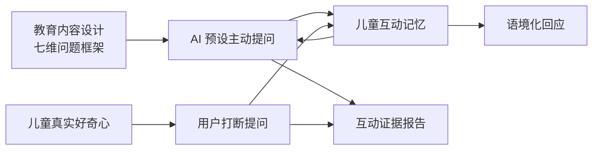
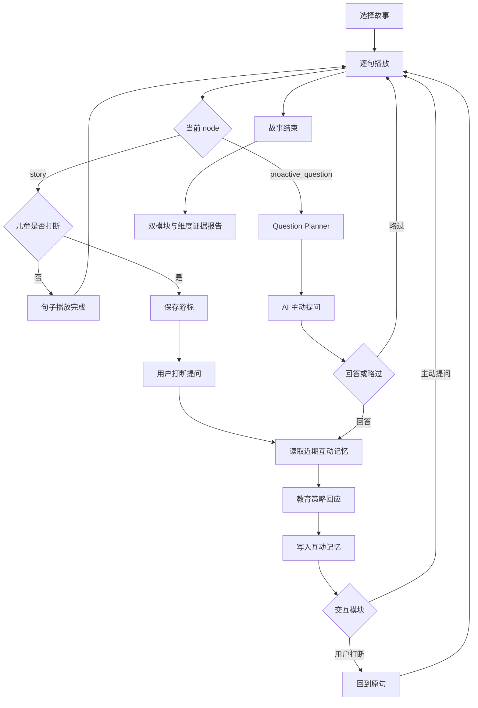

# Product logic

## 1. 产品命题

StoryPal 是儿童 AI 教育互动内容产品。它把教育问题设计、故事编排、儿童自主提问和会话记忆放进同一条内容体验，而不是在播放器外增加一个通用聊天框。

目标用户和使用场景目前是产品假设，公开版没有把它写成已验证的用户研究结论：

- **直接使用者**：6–10 岁、能够理解故事并进行简单表达的儿童；
- **购买与决策者**：关注内容价值、主动表达和数据安全的家长；
- **典型场景**：家庭独立收听、亲子共读辅助、短时内容互动；
- **不覆盖场景**：教育测评、心理咨询、无人监护的开放式儿童聊天。

## 2. 三个核心产品系统



### 系统 A：AI 预设主动提问

内容团队在故事改编阶段设计提问时机、教育维度、学习目标和脚手架。运行时 Question Planner 从当前节点的问题候选池中选择一个适合本次会话维度覆盖的问题。

它解决：孩子不主动提问时，产品如何在不破坏故事的情况下创造表达和思考机会。

### 系统 B：用户打断提问

孩子在故事播放中随时暂停，问题可以是知识、情绪、想象、逻辑或故事理解。系统把当前句和近期互动交给 Provider，回答后回到原句。

它解决：孩子的真实好奇心如何及时进入内容流程。

### 系统 C：儿童互动记忆

Memory Layer 保存本次会话中的互动来源、儿童表达、回答、情节上下文、教育维度和输入类型。它为主动问题选择、语境回应和事实报告提供依据。

它解决：多轮互动如何保持连续、减少机械重复，同时避免建立未经授权的长期儿童画像。

## 3. 七维教育问题框架

框架源于原 StoryPal 的能力 schema、Prompt 设计和内容生产规范。

| 维度 | 设计目标 | 常见问题形式 | 回应原则 |
| --- | --- | --- | --- |
| 大语文 | 理解词语、修辞、文学表达和主题 | 顺序复述、解释词句、表达主题 | 抓住具体语言材料，帮助孩子说清楚 |
| 百科知识 | 建立准确、可想象的事实认知 | “它是什么”“为什么会这样” | 给具体小知识，无把握不编造 |
| 文化理解 | 理解神话、历史、传统与人物背景 | 文化符号、时代生活、人物典故 | 提供真实背景，不用现代概念生硬套用 |
| 逻辑思维 | 梳理原因、证据、顺序、选择和结果 | 因果、预测、比较、线索整合 | 用步骤和证据说明，不只判断对错 |
| 情绪理解 | 识别感受、原因和角色视角 | “他是什么心情”“为什么” | 接住具体情绪，连接儿童熟悉经验 |
| 想象力 | 保护创意并拓展可能性 | 预测、反事实、续编、角色替换 | 先展开脑洞，再说明故事或现实边界 |
| 语言表达 | 组织描述、复述和观点 | 完整句、顺序词、理由表达 | 帮助整理表达，不替孩子给标准答案 |

### 问题设计元数据

每个主动问题候选包含：

| 字段 | 用途 |
| --- | --- |
| `question_id` | 版本、测试和报告追踪 |
| `prompt` | 面向孩子的问题 |
| `primary_dimension` | 本轮主要教育维度 |
| `dimensions` | 主/副维度组合 |
| `question_type` | 角色视角、因果、情绪、复述等形式 |
| `learning_goal` | 这次表达希望支持什么 |
| `scaffold_prompt` | 孩子不知道时降低难度的提示 |
| `trigger_reason` | 为什么把问题放在这个情节位置 |
| `follow_up_policy` | 追问次数、略过与返回故事规则 |

## 4. 主动问题的内容生产逻辑

主动提问在故事改编阶段完成，而不是由模型临场自由生成。内容生产规则：

1. 每个故事建议 2–4 个主动互动点；
2. 只放在剧情自然停顿处，例如选择、转折、因果揭示、情绪变化和知识线索之后；
3. 互动 node 只承担问题和教育目标，不续写故事；
4. 一次问题只要求一个主要认知动作；
5. 问题能用儿童熟悉的语言回答，不依赖标准术语；
6. 开放问题不预设唯一答案；
7. 每个问题提供至少一个降低难度的脚手架；
8. 儿童可以略过，略过不影响继续听故事。

### Memory-aware 选择

同一个主动节点可以有多个经过审核的候选问题。公开版的 Planner 使用：

```text
当前 proactive_question node
+ 候选问题的 primary_dimension
+ 本次会话主动问题维度覆盖次数
→ 优先选择尚未覆盖或覆盖较少的维度
```

这是一种低风险个性化：选择范围仍由内容团队控制，Memory 只改变候选优先级。

## 5. 两种交互的流程差异

| 产品规则 | AI 预设主动提问 | 用户打断提问 |
| --- | --- | --- |
| 发起者 | 系统 | 儿童 |
| 触发时机 | 到达内容设计的主动问题节点 | 任意故事句播放中 |
| 问题来源 | 经过审核的问题候选池 | 儿童实时表达 |
| 教育维度 | 内容预设，Planner 选择 | 根据儿童输入分类 |
| 对话上下文 | 学习目标、当前情节、近期记忆 | 当前故事句、近期记忆 |
| 不知道时 | 使用 `scaffold_prompt` | 澄清或给具体小提示 |
| 可否略过 | 可以 | 不适用 |
| 回答后 | 进入下一 node | 回到被打断原句 |

两条路径共用 Provider 和 Memory，但不能共用恢复规则。

## 6. 核心闭环



## 7. 关键业务规则

| 编号 | 规则 | 原因 |
| --- | --- | --- |
| R1 | 只有 `playing + story node` 可以用户打断 | 回答或主动问题期间再次打断会产生并发状态 |
| R2 | 打断时不增加 `sentence_index` | 恢复位置必须是被打断句 |
| R3 | 打断回答后先发 `story_resumed`，再重发原句 | 恢复儿童的故事语境 |
| R4 | 主动问题回答或略过后进入下一 node | 主动问题本身是独立内容节点 |
| R5 | 主动问题只从审核后的候选池选择 | 控制教育目标和内容安全 |
| R6 | Planner 读取主动问题维度覆盖 | 减少会话内机械重复 |
| R7 | 每次回答后写入 MemoryEntry | 保持多轮上下文和证据链 |
| R8 | 客户端播放完才发送完成事件 | Backend 不猜测不同端的播放时长 |
| R9 | 乱序 command 返回 `error` | 防止静默推进错误游标 |
| R10 | 报告只显示互动事实和维度证据 | 不从单次行为推断稳定能力 |

## 8. 打断点恢复

收到打断时：

```text
node_index 与 sentence_index 保持不变
interrupted = true
state = awaiting_input
interaction_module = user_interrupt_question
```

回答播放完成后：

```text
interrupted = false
state = playing
发送 story_resumed
重发同一个 node_id + sentence_index
```

选择重播原句，是因为孩子可能在句子中途发起打断。按句恢复也能跨不同 TTS provider 保持稳定。

## 9. Memory Layer 逻辑

### 写入内容

- 交互模块；
- node 与当前情节摘要；
- 儿童原始表达；
- AI 实际回答；
- 教育维度；
- 输入分类；
- 回答或略过状态；
- 时间。

### 读取用途

| 使用方 | 读取内容 | 决策 |
| --- | --- | --- |
| Question Planner | 主动问题维度覆盖 | 选择较少出现的预设维度 |
| Answer Provider | 最近三条互动 | 保持回应连续，避免忽略此前表达 |
| Report | 全部 session entries | 生成模块、维度和时间线证据 |

### 安全限制

- 公开版只保存 session memory，服务重启后清空；
- 支持立即删除 session；
- 不记录身份和联系方式；
- 不把分类写成心理或能力结论；
- `dimension_coverage` 只代表互动证据数量；
- 跨会话记忆需要监护人同意、用途说明、查看和删除，当前未实现。

## 10. 原创故事如何覆盖系统

《迷路的星光》包含三个 story node 和两个 proactive question node。每个主动节点有两个问题候选：

- 第一个节点：想象力/语言表达，或情绪理解/逻辑；
- 第二个节点：逻辑/情绪理解，或大语文/语言表达。

公开演示因此覆盖：

- 连续多句播放；
- 用户打断与原句恢复；
- 主动问题的维度化选择；
- “不知道”时的脚手架；
- 主动问题略过；
- Memory 写入与近期读取；
- 双模块和维度证据报告。

七维框架不要求单个故事覆盖全部维度。内容运营应在故事库层面观察维度分布，在单个故事内只选择与情节自然相关的问题。

## 11. 失败与降级

| 情况 | 当前公开版 | 生产版本建议 |
| --- | --- | --- |
| Backend 未连接 | Web 显示断开；小程序显示内置目录 | 重试、离线缓存、明确服务状态 |
| 不支持语音合成 | 按文本长度计时推进 | 本地音频或云端 TTS 降级 |
| 非法 command | 返回 `error` | 错误码、遥测和客户端恢复 |
| 孩子说“不知道” | 使用预设脚手架 | ASR 置信度确认和分级提示 |
| 主动问题不想回答 | 支持略过 | 记录略过原因需谨慎，默认不追问 |
| 模型超时 | 当前未实现真实模型 | 友好提示、恢复故事、熔断 |
| 不安全输入输出 | 当前未实现真实模型 | 双向审核、规则回应、家长策略 |
| 进程重启 | Memory 与报告清空 | 持久化、TTL、授权与删除策略 |

## 12. 报告口径

报告可以回答：

- AI 主动提问和用户打断分别发生多少次；
- 每次互动发生在哪个内容节点；
- 本次涉及哪些教育维度，各有多少条证据；
- 儿童说了什么，系统实际回应了什么；
- 主动问题是否被略过；
- 当前 Memory 的保留范围。

报告不能回答：

- 儿童的阅读能力等级；
- 智力、性格、情绪或心理状态；
- 长期兴趣和学习效果；
- 家庭教育诊断。

## 13. 建议指标体系（待真实用户验证）

当前仓库没有真实用户数据，以下是生产验证指标，不是项目成绩。

### 双模块指标

- 主动问题到达率、回答率、略过率；
- 用户自主打断率与有效问题率；
- 不同教育维度的回答分布；
- 同一维度连续重复率；
- 脚手架触发后有效表达率。

### 连续体验指标

- 回答后续播成功率；
- 错位续播率；
- 互动后下一句继续收听率；
- 故事完成率；
- 回答延迟 P50 / P95。

### 安全护栏

- ASR 低置信度率；
- 不安全输出拦截率和误拦截抽检；
- Memory 查看、删除和关闭率；
- 儿童数据删除 SLA；
- 未经同意的跨会话记忆写入次数必须为零。

完成率不能单独作为北极星指标，因为减少互动也可能提高完成率。需要同时观察主动问题质量、儿童自主提问、续播和安全护栏。
